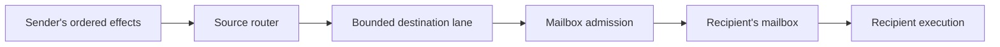

# Mixed actor topologies

A topology describes actors, their message routes, and their startup messages. A physical profile chooses which actors have dedicated circuitry and which share an executor. Changing placement preserves actor identities, message contents, and per-sender ordering; it can change latency, throughput, buffering, and the arrival order of messages from different senders.

## Actors and placement

An exact actor is one named instance, such as `collector`. A family names a rectangular collection of instances, such as `{workers, X, Y}`. Families make repeated declarations and routes convenient; they do not imply shared execution.

Every actor has its own logical state and bounded mailbox. Its placement determines their implementation:

| Placement | Callback logic | State and mailbox | When it can advance |
| --- | --- | --- | --- |
| Direct | Dedicated to this actor (`Service`) | Registers | Independently, when its work and transport permit |
| Shared group | One executor for the group's actors (`SharedService`) | Separate per-actor rows in RAM | When the group's scheduler selects it |

Ungrouped actors are direct. A direct singleton has no shared executor and does not wait for a group scheduling grant. It can process a message or advance an entry action as soon as its own dependencies permit, but pipeline latency, ordered effects, and output backpressure still apply. Register storage does not imply one-cycle execution.

For an application with a `source`, a `collector`, and a `[2, 2]` worker family, this `scheduler_groups` profile fragment shares all four workers while leaving the two exact actors direct:

```erlang
#{scheduler_groups =>
    #{worker_group => #{members => [{family, workers}],
                        state_storage => block_ram,
                        mailbox_storage => block_ram}}}
```

The resulting layout is two independent register-backed actors plus one shared worker executor and its RAMs. An empty or omitted `scheduler_groups` instead gives all six actors dedicated implementations.

A group may also contain `{actor, Id}`, including an exact actor alongside a family. Every member must use the same callback module. To divide a family between two executors, use `{family, workers, {interleaved, 0, 2}}` in one group and `{family, workers, {interleaved, 1, 2}}` in the other. These select alternating members in row-major order; together, the groups must cover the complete family. Physical slot numbers are assigned by the placement plan and are not application addresses.

## Routes and delivery

Routes name logical recipients, independently of their placement. An exact actor can target particular family members, and a family relation can target one exact actor. For example, these topology fragments describe a source fanning out to four workers, each replying to a collector:

```erlang
#{actors => #{source => source_actor, collector => collector_actor},
  families => #{workers => #{module => worker_actor, shape => [2, 2]}},
  routes => [{{source, work}, queued,
              [{actor, {workers, X, Y}} || X <- [0, 1], Y <- [0, 1]]}],
  route_relations => [{{workers, result}, [{actor, collector}]}],
  ...}
```

The complete topology must give every declared output one route. Family members inherit their family's relations; exact routes do not override individual members. Recipient coordinates, message schemas, and field layouts are checked before generation. The current frame transport also requires matching numeric schema selectors at source and destination.

A message follows this path:



The router selects a destination from the sender's output port. Admission waits for capacity in that recipient's mailbox. Acceptance into a transport queue is not acceptance by the callback: a message can still be waiting in transit or in the mailbox. Transport buffers are additional to the declared mailbox capacity.

The delivery contract is:

- Messages from one actor to one recipient enter its mailbox in source order, including messages sent through different output ports that name that same recipient. An actor can still postpone messages according to its callback semantics.
- Messages from different actors can interleave. Placement does not promise a global ordering or identical cycle timing.
- A `direct` route has one recipient. A `queued` fanout completes the sender's effect at its ordered egress; the router then hands a copy to every listed recipient's lane before advancing to its next effect. Recipients can accept and execute at different times; fanout is not atomic multicast.
- Startup messages precede ordinary routed messages at their destination, in declaration order. This is a local ordering rule, not a topology-wide startup barrier. Shared startup must fit each actor's mailbox because its group admits startup before dispatching callbacks.
- Full buffers propagate backpressure without discarding accepted messages. Bounded queues and fair arbitration do not establish deadlock freedom for an arbitrary application protocol.

## External commands

A rectangle-addressed ingress is one application input. A command selects a target and an inclusive rectangle within that ingress's coordinate space, carrying an ordinary `axis::Frame` as its payload. Target names describe recipient sets and the schemas they accept; they do not name scheduler groups. The same command stream works across placements.

For example, this fragment gives a worker family four points and an exact actor one point:

```erlang
#{ingresses => [{commands, {rectangle, [7, 6]}, [
    {all, [work], [
        {family, workers, {embed, [2, 3], [1, 1]}},
        {actor, extra, {at, [5, 2]}}]},
    {family, [work], [{family, workers, {embed, [2, 3], [1, 1]}}]},
    {singleton, [work], [{actor, extra, {at, [5, 2]}}]}
]}], ...}
```

With a `[2, 2]` family, member `{workers, X, Y}` occupies `(1 + 2X, 1 + 3Y)`: `(1,1)`, `(1,4)`, `(3,1)`, or `(3,4)`. `extra` occupies `(5,2)`. A command to `all` with rectangle `(0,0)..(6,5)` reaches all five actors; `family` with `(1,1)..(1,4)` reaches just two workers. Coordinates select logical recipients, never physical RAM slots. Different actors may occupy the same point and receive the same broadcast. Each actor or family must keep one embedding across all targets of an ingress.

The declaration checks that every recipient dispatches the target's schemas with the same field layout and numeric wire selector. The generated `ControlTarget` enum assigns selectors in sorted target-ID order. The input is `commands_in: chan<hls_spatial_router::SpatialFrame> in`; obtain its wire layout from the generated XLS interface. Currently one ingress, up to four targets, two-dimensional embeddings, and unsigned 16-bit coordinates are supported by both topology representations.

At runtime, a command reaches each recipient whose point lies within its rectangle and whose target accepts its frame's schema selector and payload-word count. An unknown target, unaccepted schema, wrong word count, reversed rectangle, or rectangle containing no selected recipients produces no actor message. A partially overlapping rectangle selects the deployed points it contains. Payload values retain the ordinary actor codec and callback semantics; this boundary does not validate their meaning.

An ingress is another ordered message source. Commands to the same recipient retain input order even through different targets. They compete with actor-originated messages at that recipient's existing admission boundary, after its declared startup messages. Mailbox bounds, backpressure, and the distinction between transport acceptance and callback execution apply unchanged. One slow recipient can hold up later commands; multicast acceptance is not atomic, and accepting a command at the application port does not acknowledge that every recipient has executed it.

## Routing and arbitration in the current implementation

There is no central message bus. Each direct actor and each shared group has an output router. The external ingress also has a router, with one destination lane per addressed actor; targets sharing a recipient share that lane. A lane connects a physical source (one direct actor or one group) to a logical recipient. Aliased output ports share that lane, retaining their order. A message for a shared actor carries its destination slot to the group's admission logic; actors sharing a source group use that group's router.

For the example above, the source router has four worker lanes. They can feed four direct actors or four mailboxes behind one shared executor. With shared workers, the group's router has one result lane to the direct collector; with direct workers, four result lanes meet at the collector's ingress. This is where placement changes the physical layout without changing the logical routes.

Arbitration occurs where resources are shared:

| Resource | Selection |
| --- | --- |
| Direct actor's ingress | Reserves a mailbox place, then polls incoming lanes in rotation |
| Shared group's admission | Selects among pending producer requests whose destination mailbox has space |
| Shared executor | Selects an eligible actor, excluding actors already in flight |
| External output | Merges its producer lanes in rotation |

These choices preserve each sender's ordering while letting unrelated senders compete. A stalled output can eventually fill a group's result and routing buffers and stall its other members too; sharing trades independent execution capacity for smaller replicated logic.

Shared routers also use an **effect-window arbiter**. Its grant permits one early return of a batch-completion credit, so a router can retain a lookahead batch while its current batch drains. It does not grant every message send or serialize all actor execution. Mixed deployments use one global arbiter for this extra capacity; direct actors do not participate. Credit returns have dedicated inputs so they do not queue behind application requests awaiting mailbox space.

The instance backend supports two-dimensional families, rectangle ingress, RAM-backed shared groups, and direct or queued routes. Source-fragment reduction placement and `weak_components` effect-window partitioning are rejected for exact-only and mixed deployments. Ordinary actor-owned reductions remain available. Partitioning needs to account for backpressure paths through direct actors as well as immediate shared-to-shared edges.

Exact-only and mixed graphs use the same placement and routing backend. Regular graphs containing only families retain a compact array representation when wholly direct or wholly shared. Repeated node and routing definitions follow family rules rather than explicitly listing every member; startup and slot tables can still grow with population. This is a source-size benefit, not a claim of faster hardware. Both representations use the same actor implementations and shared-router credit protocol.

## Inspection and validation

Enable `direct_actor_debug` for direct actors and `mailbox_debug` for shared groups in the physical profile. Get actor compilation options from `xls_topology_dslx:artifact_requirements/2`, generate `xls_scheduler_debug:projection/4` from those artifacts, and bind a single `hls_debug_catalog:hardware/4`. The catalog retains logical actor identities across placements. Both placements expose phase and failure information; shared actors additionally expose scheduler mailbox/work observations. Direct mailbox reservation counts are not yet projected. See [topology debugging](topology-debug.md).

`bash tools/test_mixed_topology.sh XLS_ROOT` compares a closed feedback workload with its CPU reference in four placements: all direct, one worker group, two interleaved groups, and a group combining family and exact workers. At pipeline depths two and three, it checks aliased message ordering, all 32 round reports, startup, and final completion. It blocks the output, diagnoses the stall through public debug queries, then requires recovery after release. Structural checks reject combinational cycles and verify that passive debug instrumentation preserves every output cycle.

Pass `ingress_direct ingress_one ingress_two ingress_coalesced` after `XLS_ROOT STAGE` to run the external-command variant. It drives commands from reset release, alternates broadcasts and point selections, and interleaves invalid commands with valid work. Bursts of harmless messages must backpressure the command input. Each placement must deliver the same 320 work items, 640 results, and 32 reports as the closed CPU workload. The host releases the next round on an application acknowledgment; completion and debug inspection use public ports rather than simulator access to actor internals.
