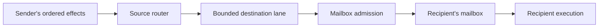

# Actor topologies

A topology describes actors, messages and routes. An exact actor is one named instance; a family is a rectangular set of instances. Families reduce repetition in declarations without changing actor semantics.

Each instance compiles to a dedicated actor with register-backed state and a bounded mailbox. It runs when its own input, state and output dependencies permit. Dedicated execution does not imply one-cycle execution: XLS pipeline latency and output backpressure still apply.

## Routes and delivery

Routes name logical recipients, independently of their placement. An exact actor can target particular family members, and a family relation can target one exact actor. For example, these topology fragments describe a source fanning out to four workers, each replying to a collector:

```erlang
#{actors => #{source => source_actor, collector => collector_actor},
  families => #{workers => #{module => worker_actor, shape => [2, 2]}},
  routes => [{{source, work}, queued,
              [{actor, {workers, X, Y}} || X <- [0, 1], Y <- [0, 1]]}],
  route_relations => [{{workers, result}, [{actor, collector}]}],
  ...}
```

The complete topology must give every declared output one route. Family members inherit their family's relations; exact routes do not override individual members. Recipient coordinates, message schemas, and field layouts are checked before generation. The current frame transport also requires matching numeric schema selectors at source and destination.

A message follows this path:


```mermaid
flowchart LR
    A[Sender's ordered effects] --> R[Source router]
    R --> Q[Bounded destination lane]
    Q --> I[Mailbox admission]
    I --> M[Recipient's mailbox]
    M --> E[Recipient execution]
```

The router selects a destination from the sender's output port. Admission waits for capacity in that recipient's mailbox. Acceptance into a transport queue is not acceptance by the callback: a message can still be waiting in transit or in the mailbox. Transport buffers are additional to the declared mailbox capacity.

The delivery contract is:

- Messages from one actor to one recipient enter its mailbox in source order, including messages sent through different output ports that name that same recipient. An actor can still postpone messages according to its callback semantics.
- Messages from different actors can interleave. Placement does not promise a global ordering or identical cycle timing.
- A `direct` route has one recipient. A `queued` fanout completes the sender's effect at its ordered egress; the router then hands a copy to every listed recipient's lane before advancing to its next effect. Recipients can accept and execute at different times; fanout is not atomic multicast.
- Startup messages precede ordinary routed messages at their destination, in declaration order. This is a local ordering rule, not a topology-wide startup barrier. Shared startup must fit each actor's mailbox because its group admits startup before dispatching callbacks.
- Full buffers propagate backpressure without discarding accepted messages. Bounded queues and fair arbitration do not establish deadlock freedom for an arbitrary application protocol.

## External commands

A rectangle-addressed ingress is one application input. A command selects a target and an inclusive rectangle within that ingress's coordinate space, carrying an ordinary `axis::Frame` as its payload. Target names describe recipient sets and the schemas they accept; they are independent of generated channel names.

For example, this fragment gives a worker family four points and an exact actor one point:

```erlang
#{ingresses => [{commands, {rectangle, [7, 6]}, [
    {all, [work], [
        {family, workers, {embed, [2, 3], [1, 1]}},
        {actor, extra, {at, [5, 2]}}]},
    {family, [work], [{family, workers, {embed, [2, 3], [1, 1]}}]},
    {singleton, [work], [{actor, extra, {at, [5, 2]}}]}
]}], ...}
```

With a `[2, 2]` family, member `{workers, X, Y}` occupies `(1 + 2X, 1 + 3Y)`: `(1,1)`, `(1,4)`, `(3,1)`, or `(3,4)`. `extra` occupies `(5,2)`. A command to `all` with rectangle `(0,0)..(6,5)` reaches all five actors; `family` with `(1,1)..(1,4)` reaches just two workers. Coordinates select logical recipients, never physical RAM slots. Different actors may occupy the same point and receive the same broadcast. Each actor or family must keep one embedding across all targets of an ingress.

The point assigned to an exact actor is a selector within this particular ingress. It does not give that actor an intrinsic geometric location. This addressing form is provisional: pooled workers and reusable completion collectors need endpoint selection that is independent of the geometry of their senders.

The declaration checks that every recipient dispatches the target's schemas with the same field layout and numeric wire selector. The generated `ControlTarget` enum assigns selectors in sorted target-ID order. The input is `commands_in: chan<hls_spatial_router::SpatialFrame> in`; obtain its wire layout from the generated XLS interface. Currently one ingress, up to four targets, two-dimensional embeddings, and unsigned 16-bit coordinates are supported by both topology representations.

At runtime, a command reaches each recipient whose point lies within its rectangle and whose target accepts its frame's schema selector and payload-word count. An unknown target, unaccepted schema, wrong word count, reversed rectangle, or rectangle containing no selected recipients produces no actor message. A partially overlapping rectangle selects the deployed points it contains. Payload values retain the ordinary actor codec and callback semantics; this boundary does not validate their meaning.

An ingress is another ordered message source. Commands to the same recipient retain input order even through different targets. They compete with actor-originated messages at that recipient's existing admission boundary, after its declared startup messages. Mailbox bounds, backpressure, and the distinction between transport acceptance and callback execution apply unchanged. One slow recipient can hold up later commands; multicast acceptance is not atomic, and accepting a command at the application port does not acknowledge that every recipient has executed it.

## Hardware generation and observation

Pass the normalized topology and a physical profile to `xls_topology_dslx:to_xls/2`. The profile selects the module name, channel depth and optional `direct_actor_debug`. Compile each actor with the options returned by `artifact_requirements/2`, then compile the topology's `Top` proc.

Messages follow source routers to recipient lanes. Independent lanes may transfer concurrently; senders targeting the same recipient arbitrate. Each actor's effects retain callback order, including aliased output ports. Queue depth controls buffering, not the application's deadlock behavior.

Enable `direct_actor_debug` consistently in the profile and actor artifacts, then generate `xls_actor_debug:projection/3`. A wrapper forwards the observation ports described by `xls_actor_observation`. Bind the verified query session with `hls_debug_catalog:hardware/4`; logical actor identities are unchanged by RTL generation. See [topology queries](topology-debug.md).

`tools/test_mixed_topology.sh XLS_ROOT` compares closed and externally commanded actor networks with their CPU results while stalling outputs and querying queues through the debug transport.
