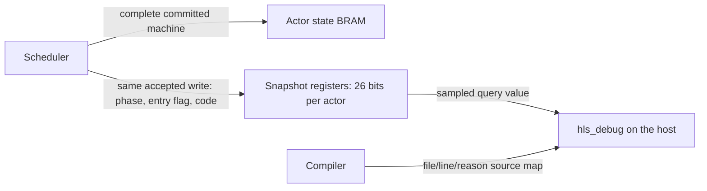

# Current-state topology queries

`tools/topology_debug.py` adds a passive diagnostic endpoint to an elaborated RTL application. It emits an instrumented application, an AXI debug wrapper, and a JSON resource/connection manifest. The host can query individual channels, FIFO occupancies, and shared-actor committed state and follow a suspected backpressure chain without keeping a history buffer in the FPGA.

Instrumentation is opt-in after XLS code generation. The ordinary generated application and its interfaces remain the production artifacts. The diagnostic wrapper exposes all original ports plus independent `s_dbg_*`/`m_dbg_*` streams. Those streams use endpoint 2 and the common [routed management framing](debug-protocol.md). An existing multi-endpoint shell can connect the inner `hls_topology_debug` service to its router instead of instantiating the single-endpoint `hls_debug_route` wrapper. A design that already has the reserved debug port names must attach at that inner boundary; the exporter rejects a conflicting outer interface.

## What is observed

The exporter uses Yosys hierarchy and flattened connectivity to discover one-bit ready/valid pairs. It collapses container aliases, retains the deepest producer and consumer endpoints, and marks constant handshakes as unsuitable for dependency inference. Missing or multiple endpoints remain explicit. Depth-zero XLS bypass FIFOs are wires and do not become graph vertices. All observed channels must share the selected top-level clock; clock-domain crossings are rejected.

The resource catalog contains:

- A channel resource for each physical handshake: value bit 0 is valid and bit 1 is ready.
- An optional actor resource for each shared scheduler slot: its latest committed phase, entry-pending flag, failure code, and initialization status.
- A FIFO resource for each supported XLS FIFO: current stored occupancy, capacity, and the IDs of its push and pop channels. `free_slots = capacity - occupancy` is computed by the host. A transfer through an empty bypass FIFO need not occupy storage; a full FIFO may accept a push alongside a pop if its implementation permits it. Consult the actual ready bit for acceptance on the sampled edge.

FIFO occupancy comes from the existing `slots` register. The XLS adapter recognizes the generated bypass FIFO with an unregistered pop interface, with or without registered push readiness. It validates the register's clock and the full-comparison constant. A recognized implementation with an unexpected shape fails generation; other FIFO variants appear in `unsupported_queues` and retain handshake probes only. The integration test independently checks each exposed occupancy against accepted pushes minus accepted pops.

The exporter adds only output aliases to the elaborated application. It does not insert queue counters or modify application cells, memories, or original ports. The wrapper adds a selector, one 64-bit clock counter, a bounded command receiver, and storage for one sampled reply. Enabling actor projections retains 26 bits per actor before synthesis: phase, entry-pending, a sixteen-bit failure code, and validity. Optional mailbox observations retain another 24 bits per actor. These are latest-value registers, not a history buffer. Debug backpressure can delay subsequent queries but cannot stall application traffic. Probe fanout and selector routing can affect physical timing and area; logical noninterference is not a timing-closure claim.

Optional generated scheduler outputs expose completed-step mailbox metadata as described below. Intermediate admission claims, RAM-adapter reservations, and reduction-bank occupancy are not decoded. Optional actor snapshots describe committed state, which can be older than an in-flight continuation. Their boundaries may be visible as channels, but the tool does not infer private state from generated signal-name guesses. A consumer with no observed blocked output is an unresolved internal wait, not evidence that it has no work.

## Generate a diagnostic build

Use the same generated RTL and RAM shell as the intended application. For example, after generating the D3 decoder profile into `$stage`:

```sh
python3 tools/topology_debug.py \
  --top phi_decoder_profile_top --clock aclk \
  --reset aresetn --reset-active-low \
  --stage "$stage/topology-debug" \
  "$stage/phi_decoder_profile.v" "$stage/phi_decoder_profile_top.v" \
  priv/rtl/hls_1r1w_ram.v
```

Yosys must be on `PATH`, or supplied with `--yosys`. Compile `topology-debug/instrumented.v`, `topology-debug/debug_top.v`, and these support modules, using `hls_debug_application` as the diagnostic top:

```text
priv/rtl/debug/hls_debug_frame_rx.v
priv/rtl/debug/hls_debug_route.v
priv/rtl/debug/hls_topology_debug.v
priv/rtl/debug/hls_actor_snapshot.v # required with actor projections
```

Keep `manifest.json` with that exact bitstream. Its SHA-256 fingerprint covers the canonical manifest, including resource wiring and source-content hashes, and is embedded in the debug endpoint. Resource IDs and generated hierarchy names are local to that build. They are not stable logical actor identities across rebuilds. The generation directory also retains the elaboration/export scripts and logs for inspection.

For a top with an active-high `reset` and `clk`, those are the defaults. `--clock`, `--reset`, and `--reset-active-low` describe the application's existing control ports; the caller must supply the correct reset polarity. All original top-level inputs and outputs are preserved.

## Shared-actor snapshots

Emit a projection alongside the DSLX and RTL from the same normalized topology and scheduler specification:

```erlang
Plan = hls_topology:from_module(phi_decoder_profile_topology),
Profile = phi_decoder_profile_topology_dslx:profile(),
Specs = maps:get(scheduler_groups, Profile),
Modules = maps:keys(xls_topology_dslx:artifact_requirements(Plan, Profile)),
Artifacts = maps:from_list([{M, begin
    {ok, Dslx} = file:read_file(atom_to_list(M) ++ ".x"),
    Dslx
end} || M <- Modules]),
ok = file:write_file("actors.json",
    json:encode(xls_scheduler_debug:projection(Plan, Specs, Artifacts))).
```

Add `--actor-projection actors.json` to the instrumentation command. If the shell containing the `scheduler_N_state` RAM instances is below the selected top, supply its instance path with `--actor-root outer.decoder`. The exporter binds to the `hls_1r1w_ram` write ports, checks their widths, common clock, and actual accepted-write logic, and uses the compiler's packed-field offsets. It rejects missing banks, duplicate identities, incomplete slot maps, and invalid field layouts. Register-backed state is not supported. Ungrouped actors retain metadata-only targets.

Supply the exact actor DSLX artifacts used by XLS, including their selected service specialization. The projection verifies their failure-code declarations and records each actor's opaque identity key, scheduler slot, module, phase codebook, and compact failure source map. At runtime, binding checks canonical numbering and source origins against the structural BEAM inventory without lowering expressions or running application transpilers. The manifest determines which origins survived lowering; it is part of the trusted compiler output, not a source-independent proof of behavior. Its binding digest covers the normalized topology and scheduler plan, including initialization and interleaved family placement. Keep the projection with its generated RTL: interface checks cannot prove that an arbitrary width-compatible RTL file implements the supplied semantic plan. The endpoint's manifest fingerprint then covers both the supplied projection and the exact RTL sources.

Each snapshot updates on an accepted state-RAM write. It copies `phase`, `enter_pending`, and the sixteen-bit `failure` code from the committed BRAM row into registers; `initialized` becomes true on the first such write after reset. Until then the state fields are `undefined`, even though the unreset application RAM may contain old values. A later write replaces the snapshot; no history is retained. No extra RAM read port, request, reservation, or application backpressure is introduced.



A sampled actor word has phase in bits 0–7, entry-pending in bit 8, failure code in bits 9–24, and initialized in bit 25. Bits 26–31 are zero. Without mailbox observations the upper 32 bits are also zero. A query returns the snapshot from before its sampling edge, so a simultaneous application write becomes visible to later queries. The returned `cycle` dates the observation, not the last commit. A stalled executor can retain a newer in-flight state; a failure is visible only after its state write commits. `enter_pending = false` does not mean the actor is idle or its mailbox empty. Queries derive `failed` from the code and decode `failure` against the manifest: `none` for zero, otherwise a reason plus file and line when a source expression is responsible. Unknown codes are rejected. No filenames, source-map tables, or execution history are stored on the device.

## Shared-scheduler mailbox observations

Set `mailbox_debug => true` in the physical family profile and pass the resulting `artifact_requirements/2` options to `xls_parse:to_xls/2` for each actor. Also pass `#{mailbox_debug => true}` as the fourth argument to `xls_scheduler_debug:projection/4`. Ordinary profiles emit no observation channels or extra application logic.

Each shared scheduler then exports a `scheduler_N_mailbox_debug_out` channel containing one 24-bit word per actor slot. A RAM shell can use `xls_scheduler_observation:wires(SchedulerPlan)` and `ports(SchedulerPlan)` alongside its RAM bindings; the latter ties observation readiness high. The D3 shell provides this arrangement through `phi_decoder_profile_top_v:to_verilog(3, #{mailbox_debug => true})`. The exporter checks the generated output's dimensions, clock, and constant readiness before connecting it to retained copies in the query wrapper. Query traffic never controls scheduler readiness.

The output describes the metadata entering a scheduler step, after the preceding step's mailbox writes and executor transfers have been accepted. It is not a continuously updated view of partially executed steps. A blocked step can leave its last sample unchanged. Samples contain:

| Item | Meaning at that scheduler boundary |
| --- | --- |
| `message_queue_len` | Committed, unconsumed mailbox entries, including postponed entries and a message whose activation has not retired |
| `postponed` | The subset of those entries marked postponed in this phase |
| `reserved` | Zero: an admission counted at this boundary has already written its payload |
| `free_slots` | Capacity minus committed entries; this is not an immediate ready signal or a reservation for the host |
| `in_flight` | An issued activation has not retired; it may be reading RAM, executing, or waiting to retire |
| `mail_candidate` | Metadata identifies an unpostponed mailbox entry; entry work and in-flight exclusion can still prevent selection |
| `entry_candidate` | Entry work is awaiting execution/classification |
| `waiting_for_egress` | Entry work needs the shared effect sequencer, or a completed activation cannot retire its effects while the preceding batch owns that sequencer |
| `egress_busy` | The scheduler's shared effect batch has not returned its completion credit; this is shared by every actor in the group |
| `scheduler_phase` | `boot`, `startup`, or `run`, independently of the actor's application phase |

`mailbox_initialized` is false until the first metadata sample after reset; mailbox fields are then `undefined`. Requests waiting in producer registers or upstream FIFOs do not yet own mailbox slots and are excluded from these counts. Reservations and partially accepted work *between* scheduler boundaries are not reported. The CPU runtime exposes the same committed/postponed/free-slot accounting between callbacks.

Actor-state RAM writes and scheduler metadata have separate publication boundaries. A query samples their retained copies on one edge; it does **not** make their underlying commits atomic. In particular, do not infer that a phase change and a mailbox count happened together. `cycle` dates the query, not either publication. Use physical ready/valid probes to investigate a stalled scheduler step; repeated unchanged metadata alone does not establish a deadlock or its duration.

With this option enabled, resource bits 32–39 hold depth, 40–47 postponed count, 48 in-flight, 49 mail candidate, 50 entry candidate, 51 egress waiter, 52 shared egress busy, 53–54 scheduler phase, and 55 mailbox validity. Bits 56–63 are zero. XLS array packing places slot zero in the least significant 24-bit word of the generated output. The DSLX packing, host decoding, and RTL retention tests share byte-level vectors.

## Query and inspect waits

The live hardware adapter needs to supply the same routed debug stream that the FIFO transport supplies in simulation. Use its `hls_fabric` broker at endpoint 2:

```erlang
{ok, Bytes} = file:read_file("manifest.json"),
Manifest = json:decode(Bytes),
{ok, Debug} = hls_debug:start_link(undefined, {fabric, DebugFabric, 2}),
{ok, Session} = hls_topology_debug:open(Debug, Manifest),
{ok, Sample} = hls_topology_debug:query(Session, ResourceId),
{ok, Report} = hls_topology_debug:inspect_waits(Session, [ResourceId], #{max_queries => 1024}),
ok = hls_topology_debug:write_wait_report(Session, [ResourceId], #{}, "wait.json").
```

The [common inspection interface](debug-targets.md) accepts a target selected with `hls_topology_debug:resource(Session, ResourceId)`. It supports `hls_debug:info(Target, Items)` and single-seed `hls_debug:inspect_waits(Target, Options)`. Physical FIFO occupancy remains distinct from an actor's mailbox depth.

`open/2` checks the embedded fingerprint and catalog counts against the supplied manifest. A query returns its resource ID, observation cycle, and value; channels also have boolean `valid`/`ready` fields, and FIFOs have `occupancy`/`free_slots`. A mismatched resource ID or impossible FIFO occupancy is rejected. Queries use a ten-second timeout; after a transport timeout or reset, establish a fresh transport session before continuing a diagnosis.

Find a resource ID and render a saved report with:

```sh
python3 tools/topology_debug_report.py manifest.json --find scheduler_0
python3 tools/topology_debug_report.py manifest.json wait.json
```

The inspection starts at the supplied FIFO or channel IDs. For a FIFO it queries its push/pop boundaries. When a channel is valid but not ready, it follows its unique consumer. At a FIFO it reads occupancy and follows the pop channel; at another component it probes that component's outgoing channels as possible dependencies. An external consumer terminates that branch. Visited resources are queried once during exploration and once again during recheck. The budget reserves space for those rechecks and explicitly reports truncated exploration.

Reports distinguish external sinks, ambiguous connections, candidate blocked outputs, changed resources, and cyclic groups of channels blocked on both visits. Unrelated progressing components need not be queried. The same host walker is used with the live debug client and with deterministic test providers.

A query samples its value and timestamp together before the accepting clock edge's application state updates. The held reply stays immutable until consumed. Different queries observe different edges. Repeated equal values do not prove that a queue stayed full between visits, and the interval between observations is not a measured stall age. A cyclic group of repeatedly blocked channels is a candidate for investigation, not proof of deadlock: wiring alone does not identify the exact continuation or arbitration condition that an actor requires. The 64-bit timestamp resets with the application and wraps after `2^64` cycles; the walker rejects nonincreasing observations, but a reset followed by a sufficiently long gap can escape that check.

## Inner query protocol, schema 4

All words are little-endian. Request flags are zero and all beats have full keep. Replies preserve the request transaction ID. The outer single-endpoint router accepts `{source:16, destination:16}` as a route word and returns `{2:16, source:16}` before the reply header.

| Operation | Request payload | Reply payload |
| --- | --- | --- |
| `INFO` `0x10` → `0x90` | Empty | Schema `4`, resource count, channel count, FIFO count, actor count, 32 fingerprint bytes (13 words total) |
| `QUERY` `0x11` → `0x91` | Resource ID (1 word) | Resource ID, cycle low, cycle high, value low, value high (5 words) |
| Error `0xff` | — | Code `1`: malformed/unsupported request; code `2`: out-of-range resource ID |

Malformed inner requests drain through their actual `TLAST`, even beyond 255 beats, and produce one error with the original transaction ID. Payload words cannot become headers. The standalone router drops malformed route words or wrong destinations through `TLAST`. It retains frame ownership through the response's accepted final beat. Missing `TLAST` requires reset to abort the packet. There are no commands that mutate application state.

## Verification

`python3 tools/test_topology_debug.py` checks discovery contracts, structural noninterference, and the routed RTL protocol without XLS. `rebar3 eunit` covers manifest fingerprints, decoding, adaptive exploration, query budgets, cyclic candidates, transient waits, and timestamp regression. `python3 tools/test_sim_bridge.py` checks the real VPI transport, including debug-only mode.

The generated application integration runner takes the exporter's arguments:

```sh
python3 tools/test_topology_debug_integration.py \
  --top __ordered_egress_topology__Top_0_next \
  --stage _build/topology-debug-queries/ordered \
  _build/xls_sim/regsvc/ordered_egress_topology.v
```

It runs the Erlang client against a real Icarus/FIFO/VPI endpoint, identifies full queues, follows the external stall, and checks recovery after releasing the sink. It compares the original and diagnostic application outputs at every cycle and independently checks every FIFO occupancy with a transfer scoreboard. The same runner accepts the D3 wrapper arguments above. D3 has two sinks, so one can progress while the selected sink is blocked. CI regenerates and exercises the ordered-egress topology with its pinned XLS release.

`bash tools/test_actor_debug.sh XLS_ROOT` generates an eight-actor topology in two pipeline schedules. Public scoped queries identify failures in included helpers, an earlier bad match, explicit `fail`, and unmatched callbacks while healthy neighbors are blocked, then verify them after release. Snapshot RTL tests cover slot isolation, independent metadata updates, disabled and unused-address writes, and reset. The integration runner accepts `--actor-projection actors.json --actor-test phi` for the D3 profile and checks all 36 actors before and after release.

`bash tools/test_actor_debug.sh XLS_ROOT _build/mailbox-debug mailbox` runs a six-actor producer/consumer topology at two and three pipeline stages. An external stall separates two work messages from the message that advances the consumer's phase. Public queries verify two postponed entries, then empty mailboxes and successful replay after release; CPU tests use the same consumer. `bash tools/test_actor_debug.sh XLS_ROOT _build/mailbox-debug-d3 phi` generates the diagnostic D3 application and checks all 36 actors under backpressure. These tests compare each generated application with and without the post-RTL query wrapper on every cycle; they do not by themselves compare independently scheduled production and diagnostic DSLX configurations.

## Measure diagnostic logic

```sh
python3 tools/measure_topology_debug.py "$stage/topology-debug" \
  --stage "$stage/debug-area" --yosys /path/to/yosys --seeds 5
```

This compares physical-only queries with physical queries plus actor snapshots, including mailbox snapshots when selected by the supplied projection. A mailbox-enabled build also measures phase/failure snapshots alone (`actor_state`), isolating the incremental mailbox retention and selection cost. It makes application observations unconstrained inputs while retaining aliases and constants discovered during elaboration. All cases use schema 4 and the same manifest constant. The unchanged outer route adapter is excluded. It runs `synth_xilinx -flatten -abc9 -arch xc7 -noiopad` after scrambling internal names with matched seeds, retaining the generated Verilog, Yosys scripts/logs, individual LUT/FF/BRAM counts, and best/mean/population-variance/worst summaries.

The result isolates diagnostic logic cost at its observation boundary. It does not measure complete-application area or placed/routed timing, and application-specific invariants can allow further optimization. Seed variation measures mapping sensitivity, not an unbiased statistical population. Changes to probe fanout still require timing qualification in the integrated design.
