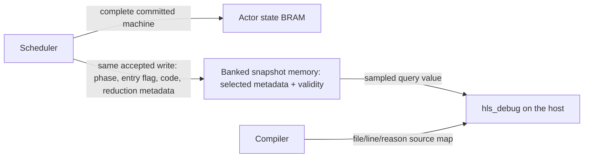

# Current-state topology queries

`tools/topology_debug.py` adds a passive diagnostic endpoint to an elaborated RTL application. It emits an instrumented application, an AXI debug wrapper, and a JSON resource/connection manifest. The host can query individual channels, FIFO occupancies, and shared-actor committed state and follow a suspected backpressure chain without keeping a history buffer in the FPGA.

Instrumentation is opt-in after XLS code generation. The ordinary generated application and its interfaces remain the production artifacts. The diagnostic wrapper exposes all original ports plus independent `s_dbg_*`/`m_dbg_*` streams. Those streams use endpoint 2 and the common [routed management framing](debug-protocol.md). An existing multi-endpoint shell can connect the inner `hls_topology_debug` service to its router instead of instantiating the single-endpoint `hls_debug_route` wrapper. A design that already has the reserved debug port names must attach at that inner boundary; the exporter rejects a conflicting outer interface.

## What is observed

The exporter uses Yosys hierarchy and flattened connectivity to discover one-bit ready/valid pairs. It collapses container aliases, retains the deepest producer and consumer endpoints, and marks constant handshakes as unsuitable for dependency inference. Missing or multiple endpoints remain explicit. Depth-zero XLS bypass FIFOs are wires and do not become graph vertices. All observed channels must share the selected top-level clock; clock-domain crossings are rejected.

The resource catalog contains:

- A channel resource for each physical handshake: value bit 0 is valid and bit 1 is ready.
- An optional actor resource for each shared scheduler slot: its latest committed phase, entry-pending flag, failure code, and initialization status.
- A FIFO resource for each supported XLS FIFO: current stored occupancy, capacity, and the IDs of its push and pop channels. `free_slots = capacity - occupancy` is computed by the host. A transfer through an empty bypass FIFO need not occupy storage; a full FIFO may accept a push alongside a pop if its implementation permits it. Consult the actual ready bit for acceptance on the sampled edge.

FIFO occupancy comes from the existing `slots` register. The XLS adapter recognizes generated FIFOs with or without bypass and with an unregistered pop interface, including registered push readiness. This includes the scheduler's registered selection-publication queue. It validates the register's clock and the full-comparison constant. A recognized implementation with an unexpected shape fails generation; other FIFO variants appear in `unsupported_queues` and retain handshake probes only. The integration test independently checks each exposed occupancy against accepted pushes minus accepted pops.

The exporter adds only output aliases to the elaborated application. It does not insert queue counters or modify application cells, memories, or original ports. The wrapper adds a selector, one 64-bit clock counter, a bounded command receiver, and storage for one sampled reply. Enabling actor projections retains 26 bits per actor before synthesis: phase, entry-pending, a sixteen-bit failure code, and validity. Actors with reductions also retain 50 + site-width + remaining-width bits, excluding the accumulator and member bitmap. These metadata bits share the indexed memory per scheduler bank; one validity bit per actor resets independently. Optional mailbox observations retain another 24 bits per actor in registers because all slots publish together. Both stores retain only the latest value. Debug backpressure can delay subsequent queries but cannot stall application traffic. Probe fanout and selector routing can affect physical timing and area; logical noninterference is not a timing-closure claim.

Optional generated scheduler outputs expose completed-step mailbox metadata as described below. Intermediate admission claims, RAM-adapter reservations, and reduction-bank occupancy are not decoded. Optional actor snapshots describe committed state, which can be older than an in-flight continuation. Their boundaries may be visible as channels, but the tool does not infer private state from generated signal-name guesses. A consumer with no observed blocked output is an unresolved internal wait, not evidence that it has no work.

## Generate a diagnostic build

Use the same generated RTL and RAM shell as the intended application. For example, after generating the D3 decoder profile into `$stage`, pin its completed artifact bundle:

```sh
compiled=$(cd "$stage/compiled" && pwd -P)
python3 tools/topology_debug.py \
  --top phi_decoder_profile_top --clock aclk \
  --reset aresetn --reset-active-low \
  --stage "$stage/topology-debug" \
  "$compiled/phi_decoder_profile.v" "$compiled/phi_decoder_profile_top.v" \
  "$compiled/hls_1r1w_ram.v"
```

Yosys must be on `PATH`, or supplied with `--yosys`. Compile `topology-debug/instrumented.v`, `topology-debug/debug_top.v`, and these support modules, using `hls_debug_application` as the diagnostic top:

```text
priv/rtl/debug/hls_debug_frame_rx.v
priv/rtl/debug/hls_debug_route.v
priv/rtl/debug/hls_topology_debug.v
priv/rtl/debug/hls_actor_snapshot.v # required with actor projections
```

Keep `manifest.json` with that exact bitstream. Its SHA-256 fingerprint covers the canonical manifest, including resource wiring and source-content hashes, and is embedded in the debug endpoint. Resource IDs and generated hierarchy names are local to that build. They are not stable logical actor identities across rebuilds. The generation directory also retains the elaboration/export scripts and logs for inspection.

For a top with an active-high `reset` and `clk`, those are the defaults. `--clock`, `--reset`, and `--reset-active-low` describe the application's existing control ports; the caller must supply the correct reset polarity. All original top-level inputs and outputs are preserved.

## Shared counter/trace and query transport

Add `--monitor-rx s_axis --monitor-tx m_axis --monitor-routed` to the instrumentation command to attach a passive boundary monitor to a pair of 32-bit application streams. Each prefix must expose `tdata`, `tvalid`, `tready`, and `tlast` with the input/output directions of an AXIS receiver or sender. Omit `--monitor-routed` for frames without outer route words. The selected boundary and endpoint are included in the manifest fingerprint. Probe discovery runs on the application before either debug service is attached.

The generated `hls_debug_application` exposes one debug stream pair:

| Destination endpoint | Service | Host API |
| --- | --- | --- |
| 1 | Boundary counters and recorded application headers | `hls_debug:get_counters/1,2`, `get_trace/1,2` on a boundary handle |
| 2 | Physical queue/handshake and committed actor/mailbox queries | `hls_topology_debug:open/2`, scoped `hls_debug:info/2,3` and `inspect_waits/2` |

Two `hls_debug` clients register those peer endpoints with the same `hls_fabric` broker. Counter/trace snapshots and physical queries remain separate observations with their respective timestamp conventions and wrapping widths; the catalog does not create an atomic cross-service snapshot. The router retains the request's service and return address until the reply's accepted `TLAST`. Partial route words and unknown destinations are drained; partial request words reach the selected service for protocol validation. Queries are serialized across services, including a trace drain. A blocked debug reader delays all later replies; it cannot stop application execution, actor observation updates, or boundary capture. Trace capacity and overflow semantics remain those of the [counter/trace protocol](debug-protocol.md). A permanently incomplete request or unread reply requires transport recovery/reset; there is no router timeout.

Compile the generated wrapper with `hls_debug_route.v`, `hls_debug_frame_rx.v`, `hls_topology_debug.v`, `hls_actor_snapshot.v`, and, when a boundary is selected, `hls_debug_monitor.v`, `hls_debug_tap.v`, `hls_trace_store.v`, and the generated XLS `hls_debug_observer.v` / `hls_debug_server.v`.

### Complete D3 phi-memory fixture

```sh
python3 tools/build_phi_debug.py "$XLS_ROOT" --stage _build/phi-debug --yosys "$YOSYS"
python3 tools/test_phi_debug.py _build/phi-debug --stage _build/phi-debug/live
python3 tools/measure_phi_debug.py _build/phi-debug --stage _build/phi-debug/area \
  --yosys "$YOSYS" --seeds 5 --jobs 1
```

The build uses the deterministic `phi_memory_demo` workload at distance three, with one shared executor per actor family (six schedulers, 54 actors), mailbox observations enabled, and one monitor on the actual routed host boundary. It retains separately compiled production and observed applications, their DSLX/IR/RTL and build provenance. `debug/debug_top.v` is the composed deployment shell; `debug/instrumented.v` contains its application and passive aliases. The application-only Verilog renderer is `phi_memory_debug_top_v:application(Profile, Options)`; `phi_memory_gateway_dslx:to_dslx/3` forwards the optional observation channels through the gateway. The monitor-only demo renderer shares the same application body.

The live test holds the application output, queries actor and queue state, follows full queues to the external sink, and then blocks a trace reply while releasing the application. At least 512 application output beats must be accepted before the debug reader resumes, overflowing the live trace bank with explicit loss accounting. It checks the D3 result against ERTS and compares production and fully instrumented application outputs on every clock. The host uses the public clients and catalog; VPI only carries external stream words. Reports include decoded observations and output recovery cycles under that host schedule.

The production reference retains normal fail-stop actor execution and its machine-state failure field. The comparison isolates optional observation channels, query snapshots and transport, counters, and trace collection. It does not measure a hypothetical compiler that replaces diagnostic failure codes with a single failed bit.

The measurement maps both complete designs with Yosys `synth_xilinx -abc9 -arch xc7`, excluding I/O pads and clock buffers. It includes compiler-generated observation logic, shared routing, all query resources, and one boundary monitor. Distributed RAM consumes LUTs in the reported totals; BRAM and DSP are separate. The report retains source snapshots, commands, logs, and best/mean/population-variance/worst statistics. Increase `--jobs` only with memory headroom; failed jobs are reported as they complete, and successful measurements remain available. These are synthesis area estimates; they do not establish placed timing, power, or the cost of adding further monitored boundaries.

The [archived D3 measurement](../experiments/07-openxc7/results/phi-memory-debug-2026-09-13.md) includes five-seed area distributions, the public-interface stall diagnosis, and production/instrumented cycle comparison.

## Shared-actor snapshots

Emit a projection alongside the DSLX and RTL from the same normalized topology and scheduler specification:

```erlang
Plan = hls_topology:from_module(phi_decoder_profile_topology),
Profile = phi_decoder_profile_topology_dslx:profile(),
Specs = maps:get(scheduler_groups, Profile),
Modules = maps:keys(xls_topology_dslx:artifact_requirements(Plan, Profile)),
Artifacts = maps:from_list([{M, begin
    {ok, Dslx} = file:read_file(atom_to_list(M) ++ ".x"),
    Dslx
end} || M <- Modules]),
ok = file:write_file("actors.json",
    json:encode(xls_scheduler_debug:projection(Plan, Specs, Artifacts))).
```

Add `--actor-projection actors.json` to the instrumentation command. If the shell containing the `scheduler_N_state` RAM instances is below the selected top, supply its instance path with `--actor-root outer.decoder`. The exporter binds to the `hls_1r1w_ram` write ports, checks their widths, common clock, and actual accepted-write logic, and uses the compiler's packed-field offsets. It rejects missing banks, duplicate identities, incomplete slot maps, and invalid field layouts. Ungrouped actors can use the optional register-backed provider below. Shared schedulers still require block-RAM state for these projections.

Supply the exact actor DSLX artifacts used by XLS, including their selected service specialization. The projection verifies their failure-code declarations and records each actor's opaque identity key, scheduler slot, module, phase codebook, and compact failure source map. At runtime, binding checks canonical numbering and source origins against the structural BEAM inventory without lowering expressions or running application transpilers. The manifest determines which origins survived lowering; it is part of the trusted compiler output, not a source-independent proof of behavior. Its binding digest covers the normalized topology and scheduler plan, including initialization and interleaved family placement. Keep the projection with its generated RTL: interface checks cannot prove that an arbitrary width-compatible RTL file implements the supplied semantic plan. The endpoint's manifest fingerprint then covers both the supplied projection and the exact RTL sources.

Each snapshot updates on an accepted state-RAM write. It copies `phase`, `enter_pending`, the sixteen-bit `failure` code, and any reduction metadata from the committed application RAM row into a separate snapshot memory; `initialized` becomes true on the first such write after reset. Until then the state fields are `undefined`, even though the unreset application RAM may contain old values. A later write replaces the snapshot; no history is retained. The snapshot memory has one accepted-write input and one asynchronous query port. Its data is unreset; a resettable validity bitmap masks uninitialized rows to zero, including after reuse. On XC7 this permits distributed RAM (SLICEM LUTs), with synthesis free to choose registers for small banks. It does not consume application RAM ports or impose requests, reservations, or backpressure. The asynchronous query port preserves the sampling edge and requires no extra query cycle.



A sampled actor word has phase in bits 0–7, entry-pending in bit 8, failure code in bits 9–24, and initialized in bit 25. Bits 26–31 are zero. Bits 32–55 are zero without mailbox observations; reduction metadata starts at bit 56 when present. A query returns the snapshot from before its sampling edge, so a simultaneous application write becomes visible to later queries. The returned `cycle` dates the observation, not the last commit. A stalled executor can retain a newer in-flight state; a failure is visible only after its state write commits. `enter_pending = false` does not mean the actor is idle or its mailbox empty. Queries derive `failed` from the code and decode `failure` against the manifest: `none` for zero, otherwise a reason plus file and line when a source expression is responsible. Unknown codes are rejected. No filenames, source-map tables, or execution history are stored on the device.

## Register-backed actor snapshots

Set `direct_actor_debug => true` in the topology profile and pass its `xls_topology_dslx:artifact_requirements/2` options to `xls_parse:to_xls/2`. Supply the same option to `xls_scheduler_debug:projection/4`. The default build has no direct-actor observation channels. Each generated `Service` then publishes phase, entry-pending, failure, mailbox counts, and optional reduction metadata on an independent output. No actor data, accumulator, member bitmap, or message history is copied.

An RTL application shell can obtain bindings with `xls_actor_observation:bindings(Plan, Specs)` and add `wires(Bindings)` and `ports(Bindings)` alongside its other generated connections. `ports/1` ties each observation output ready high. The projection names those exact outputs and their packed layouts. The instrumentation pass checks the producer, directions, widths, shared clock, constant readiness, identities, and codebooks before connecting one retained snapshot per direct actor. It does not discover synthesized state-register names. Handwritten proc graphs must forward the observation channel and provide the matching compiler projection; enabling an actor artifact alone does not automatically instrument an arbitrary wrapper.

The output describes the committed `Machine` **entering** an actor step. It uses a token independent of the step's input and egress. A computed next state is not published while an output from that step remains unaccepted. Publication passes through the generated pipeline and output register, so the retained copy can lag the actor. A query remains responsive while the actor stalls, and query backpressure terminates in the debug service. Constant observation readiness is mandatory; connecting this port to a backpressured consumer could stall the actor. Adding compiler outputs can affect scheduling and physical implementation even though host queries cannot control application readiness.

The query format and `hls_debug_catalog:hardware/4` API are the same as for shared actors. `initialized` becomes true after the first post-reset observation; a direct actor can publish its initial phase before executing its initial entry. Phase, failure, mailbox counts, and reduction fields in one query come from one retained publication. The timestamp dates the query, not the state change. Direct targets advertise `message_queue_len`, `postponed`, `reserved`, `free_slots`, and `mailbox_initialized`. They do not advertise shared-scheduler work flags. Reset requires a fresh transport session and catalog as for other targets.

Projection schema 4 keeps RAM providers in `banks` and direct observation providers in `direct`. Their resource indices are contiguous across both lists. [Mixed topologies](mixed-topologies.md) can expose both providers through one catalog, including one callback module realized both directly and in a shared group. Scheduled members use their RAM provider; direct members use their observation channel. Placement changes preserve logical actor identities but require the new build's projection and catalog.

## Direct-actor mailbox observations

Direct mailbox counts are included with `direct_actor_debug => true`; the shared-scheduler `mailbox_debug` option is independent. Use the same logical actor target regardless of placement:

```erlang
hls_debug:info(Actor, [message_queue_len, postponed, reserved, free_slots]).
```

`message_queue_len` counts received, unconsumed entries, including postponed messages. `postponed` counts the subset awaiting a phase change. `reserved` is zero or one: an admission credit claims a mailbox place until its frame is received. That frame may still be in transport. `free_slots` excludes both received messages and that reservation:

```text
message_queue_len + reserved + free_slots = mailbox_capacity
```

For example, a capacity-three consumer can have two postponed messages and one outstanding admission credit. It reports depth two, reserved one, and free zero. The third frame can still arrive using that credit; free zero is not a statement that the input handshake is blocked. Upstream frames without an admission credit do not own mailbox capacity and are excluded.

All these counts describe the committed state entering the actor step, including when an output stalls retirement. They share a publication with phase, failure, and reduction state. Until the first post-reset publication, `mailbox_initialized` is false and counts are `undefined`. These samples retain no payloads, history, or last-update timestamp. Use physical ready/valid queries to investigate transport progress rather than inferring deadlock from unchanged counts alone.

Direct resource bits 32–39 hold depth, 40–47 postponed count, 48 reservation, and 55 mailbox validity; bits 49–54 are zero. The projection and resource declare `mailbox_kind = direct`, distinguishing this word from the shared scheduler's work flags. The host validates that postponed does not exceed depth and depth plus reservation does not exceed capacity. Projection schema 4 must be regenerated with its RTL and manifest; the query packet format remains schema 5.

## Reduction observations

`hls_debug:info(Actor, reduction)` returns `idle` when no window is active, `undefined` before the first committed snapshot after reset, or a map such as:

```erlang
#{status => open, phase => gathering, name => sum, key => 0,
  population => {count, 3}, received => 2, remaining => 1,
  failure => #{code => 61, kind => badarith,
               file => <<"hls_reduction_failure_fixture.erl">>, line => 47}}
```

The phase and reduction name identify the opening site. `population` is `{count, N}` or `{members, Members}`; `remaining` counts contributions still required and `received` counts accepted contributions. It does not identify which fixed members are missing: the member bitmap and accumulator are not retained. Site names, populations, and failure source maps live in the manifest. Resource-level queries return names as binaries; catalog-bound actors use the verified Erlang atoms.

A pending reduction `failure` is separate from the actor's top-level terminal `failure`. A failed fold remains `open` and accepts the remaining valid contributions without invoking the reducer again. It becomes `complete` with zero remaining contributions before releasing that failure to the actor. Healthy completion clears the window. Queries do not release, cancel, or consume the window. A complete failed window can remain visible after the actor has stopped.

Phase, terminal failure, and reduction metadata come from the same accepted state write or direct-actor publication and are sampled together in one reply. They can lag an executing callback. With source-fragment offloading, the recipient accepts a complete aggregate at once: its count remains at the full population and its reduction failure remains `none` until that aggregate arrives. Work and failures retained in partial source fragments or the combining service are outside this observation. A healthy recipient snapshot therefore does not establish that its contributors are healthy, and a remaining count alone does not establish deadlock.

Projection schema 4 supplies packed source offsets and observation offsets for status (2 bits), site (1–8), key (32), remaining count (1–8), and pending failure (16). They occupy consecutive observation bits starting at 56, using at most 66 bits. The snapshot stores only these selected bits alongside the existing 25 actor-state bits, with one shared validity bit; it requires no additional application RAM port. The query's 128-bit value leaves unused bits zero. The wider schema-5 reply adds two stream beats to each query, including physical FIFO/channel queries, and remains immutable under debug backpressure. Hosts, manifests, and debug RTL must be regenerated together.

## Shared-scheduler mailbox observations

Set `mailbox_debug => true` in the physical family profile and pass the resulting `artifact_requirements/2` options to `xls_parse:to_xls/2` for each actor. Also pass `#{mailbox_debug => true}` as the fourth argument to `xls_scheduler_debug:projection/4`. Ordinary profiles emit no observation channels or extra application logic.

Each shared scheduler then exports a `scheduler_N_mailbox_debug_out` channel containing one 24-bit word per actor slot. A RAM shell can use `xls_scheduler_observation:wires(SchedulerPlan)` and `ports(SchedulerPlan)` alongside its RAM bindings; the latter ties observation readiness high. The D3 shell provides this arrangement through `phi_decoder_profile_top_v:to_verilog(3, #{mailbox_debug => true})`. The exporter checks the generated output's dimensions, clock, and constant readiness before connecting it to retained copies in the query wrapper. Query traffic never controls scheduler readiness.

The output describes the metadata entering a scheduler step, after the preceding step's mailbox writes and executor transfers have been accepted. It is not a continuously updated view of partially executed steps. A blocked step can leave its last sample unchanged. Samples contain:

| Item | Meaning at that scheduler boundary |
| --- | --- |
| `message_queue_len` | Committed, unconsumed mailbox entries, including postponed entries and a message whose activation has not retired |
| `postponed` | The subset of those entries marked postponed in this phase |
| `reserved` | Zero: an admission counted at this boundary has already written its payload |
| `free_slots` | Capacity minus committed entries; this is not an immediate ready signal or a reservation for the host |
| `in_flight` | An issued activation has not retired; it may be reading RAM, executing, or waiting to retire |
| `mail_candidate` | Metadata identifies an unpostponed mailbox entry; entry work and in-flight exclusion can still prevent selection |
| `entry_candidate` | Entry work is awaiting execution/classification |
| `waiting_for_egress` | Entry work needs the shared effect sequencer, or a completed activation cannot retire its effects while the preceding batch owns that sequencer |
| `egress_busy` | The scheduler's shared effect batch has not returned its completion credit; this is shared by every actor in the group |
| `scheduler_phase` | `boot`, `startup`, or `run`, independently of the actor's application phase |

Until the first metadata sample after reset, `mailbox_initialized` is false and mailbox fields are `undefined`. Requests waiting in producer registers or upstream FIFOs do not yet own mailbox slots and are excluded from these counts. Reservations and partially accepted work *between* scheduler boundaries are not reported. The CPU runtime exposes the same committed/postponed/free-slot accounting between callbacks.

Actor-state RAM writes and scheduler metadata have separate publication boundaries. A query samples their retained copies on one edge; it does **not** make their underlying commits atomic. In particular, do not infer that a phase change and a mailbox count happened together. `cycle` dates the query, not either publication. Use physical ready/valid probes to investigate a stalled scheduler step; repeated unchanged metadata alone does not establish a deadlock or its duration.

With this option enabled, resource bits 32–39 hold depth, 40–47 postponed count, 48 in-flight, 49 mail candidate, 50 entry candidate, 51 egress waiter, 52 shared egress busy, 53–54 scheduler phase, and 55 mailbox validity. Reduction metadata, when present, starts at bit 56. XLS array packing places slot zero in the least significant 24-bit word of the generated output. The DSLX packing, host decoding, and RTL retention tests share byte-level vectors.

## Query and inspect waits

The live hardware adapter needs to supply the same routed debug stream that the FIFO transport supplies in simulation. Use its `hls_fabric` broker at endpoint 2:

```erlang
{ok, Bytes} = file:read_file("manifest.json"),
Manifest = json:decode(Bytes),
{ok, Debug} = hls_debug:start_link(undefined, {fabric, DebugFabric, 2}),
{ok, Session} = hls_topology_debug:open(Debug, Manifest),
{ok, Sample} = hls_topology_debug:query(Session, ResourceId),
{ok, Report} = hls_topology_debug:inspect_waits(Session, [ResourceId], #{max_queries => 1024}),
ok = hls_topology_debug:write_wait_report(Session, [ResourceId], #{}, "wait.json").
```

The [common inspection interface](debug-targets.md) accepts a target selected with `hls_topology_debug:resource(Session, ResourceId)`. It supports `hls_debug:info(Target, Items)` and single-seed `hls_debug:inspect_waits(Target, Options)`. Physical FIFO occupancy remains distinct from an actor's mailbox depth.

`open/2` checks the embedded fingerprint and catalog counts against the supplied manifest. A query returns its resource ID, observation cycle, and value; channels also have boolean `valid`/`ready` fields, and FIFOs have `occupancy`/`free_slots`. A mismatched resource ID or impossible FIFO occupancy is rejected. Queries use a ten-second timeout; after a transport timeout or reset, establish a fresh transport session before continuing a diagnosis.

Find a resource ID and render a saved report with:

```sh
python3 tools/topology_debug_report.py manifest.json --find scheduler_0
python3 tools/topology_debug_report.py manifest.json wait.json
```

The inspection starts at the supplied FIFO or channel IDs. For a FIFO it queries its push/pop boundaries. When a channel is valid but not ready, it follows its unique consumer. At a FIFO it reads occupancy and follows the pop channel; at another component it probes that component's outgoing channels as possible dependencies. An external consumer terminates that branch. Visited resources are queried once during exploration and once again during recheck. The budget reserves space for those rechecks and explicitly reports truncated exploration.

Reports distinguish external sinks, ambiguous connections, candidate blocked outputs, changed resources, and cyclic groups of channels blocked on both visits. Unrelated progressing components need not be queried. The same host walker is used with the live debug client and with deterministic test providers.

A query samples its value and timestamp together before the accepting clock edge's application state updates. The held reply stays immutable until consumed. Different queries observe different edges. Repeated equal values do not prove that a queue stayed full between visits, and the interval between observations is not a measured stall age. A cyclic group of repeatedly blocked channels is a candidate for investigation, not proof of deadlock: wiring alone does not identify the exact continuation or arbitration condition that an actor requires. The 64-bit timestamp resets with the application and wraps after `2^64` cycles; the walker rejects nonincreasing observations, but a reset followed by a sufficiently long gap can escape that check.

## Inner query protocol, schema 5

All words are little-endian. Request flags are zero and all beats have full keep. Replies preserve the request transaction ID. The outer single-endpoint router accepts `{source:16, destination:16}` as a route word and returns `{2:16, source:16}` before the reply header.

| Operation | Request payload | Reply payload |
| --- | --- | --- |
| `INFO` `0x10` → `0x90` | Empty | Schema `5`, resource count, channel count, FIFO count, actor count, 32 fingerprint bytes (13 words total) |
| `QUERY` `0x11` → `0x91` | Resource ID (1 word) | Resource ID, cycle low, cycle high, 128-bit value in four low-to-high words (7 words) |
| Error `0xff` | — | Code `1`: malformed/unsupported request; code `2`: out-of-range resource ID |

Malformed inner requests drain through their actual `TLAST`, even beyond 255 beats, and produce one error with the original transaction ID. Payload words cannot become headers. The standalone router drops malformed route words or wrong destinations through `TLAST`. It retains frame ownership through the response's accepted final beat. Missing `TLAST` requires reset to abort the packet. There are no commands that mutate application state.

## Verification

`python3 tools/test_topology_debug.py` checks discovery contracts, structural noninterference, and the routed RTL protocol without XLS. `rebar3 eunit` covers manifest fingerprints, decoding, adaptive exploration, query budgets, cyclic candidates, transient waits, and timestamp regression. `python3 tools/test_sim_bridge.py` checks the real VPI transport, including debug-only mode.

The generated application integration runner takes the exporter's arguments:

```sh
python3 tools/test_topology_debug_integration.py \
  --top __ordered_egress_topology__Top_0_next \
  --stage _build/topology-debug-queries/ordered \
  _build/xls_sim/regsvc/ordered_egress_topology.v
```

It runs the Erlang client against a real Icarus/FIFO/VPI endpoint, identifies full queues, follows the external stall, and checks recovery after releasing the sink. It compares the original and diagnostic application outputs at every cycle and independently checks every FIFO occupancy with a transfer scoreboard. The same runner accepts the D3 wrapper arguments above. D3 has two sinks, so one can progress while the selected sink is blocked. CI regenerates and exercises the ordered-egress topology with its pinned XLS release.

`bash tools/test_actor_debug.sh XLS_ROOT` generates a 19-actor topology in two pipeline schedules. Public scoped queries identify failures in included helpers, an earlier bad match, explicit `fail`, and unmatched callbacks while healthy neighbors are blocked, then verify them after release. Snapshot RTL tests cover slot isolation, independent metadata updates, disabled and unused-address writes, and reset. The integration runner accepts `--actor-projection actors.json --actor-test phi` for the D3 profile and checks all 36 actors before and after release.

`bash tools/test_actor_debug.sh XLS_ROOT _build/mailbox-debug mailbox` runs a six-actor producer/consumer topology at two, three, and four pipeline stages. An external stall separates two work messages from the message that advances the consumer's phase. Public queries verify two postponed entries, then empty mailboxes and successful replay after release; CPU tests use the same consumer. The `direct_mailbox` and `mailbox_mixed` modes run the same workload at two and three stages, checking direct reservations, common capacity accounting, and placement-specific capabilities through `hls_debug`. `bash tools/test_actor_debug.sh XLS_ROOT _build/mailbox-debug-d3 phi` generates the diagnostic D3 application and checks all 36 actors under backpressure. These tests compare each generated application with and without the post-RTL query wrapper on every cycle; they do not by themselves compare independently scheduled production and diagnostic DSLX configurations.

`bash tools/test_actor_debug.sh XLS_ROOT _build/direct-actor-debug direct_reduction` checks five register-backed actors at two and three pipeline stages. Public queries distinguish a healthy incomplete reduction from a pending failed fold, inspect terminal source-located failures after the missing contributors arrive, and follow a stalled report to the external sink before release. The generated observed application and its instrumented export are compared every clock; a separately compiled diagnostics-disabled application is checked for the same complete output frame. This bounded workload does not establish equal throughput for every topology. `python3 tools/test_direct_actor_debug.py` also checks direct/mixed provider validation, passive aliasing, retained-row isolation, and reset.

## Measure diagnostic logic

The [D3 reduction-inspection measurement](../experiments/07-openxc7/results/reduction-inspection-2026-09-15.md) compares this query service with merged main using two matched seeds, including distributed-memory LUTs and the wider reply.

```sh
python3 tools/measure_topology_debug.py "$stage/topology-debug" \
  --stage "$stage/debug-area" --yosys /path/to/yosys --seeds 5
```

This compares physical-only queries with physical queries plus actor snapshots, including mailbox snapshots when selected by the supplied projection. A mailbox-enabled build also measures committed-state snapshots without mailbox retention (`actor_state`), isolating the incremental mailbox retention and selection cost. It makes application observations unconstrained inputs while retaining aliases and constants discovered during elaboration. All cases use schema 5 and the same manifest constant. The unchanged outer route adapter is excluded. It runs `synth_xilinx -flatten -abc9 -arch xc7 -noiopad` after scrambling internal names with matched seeds, retaining the generated Verilog, Yosys scripts/logs, individual logic-LUT, RAM-LUT, flip-flop, RAMB18, and RAMB36 counts, and best/mean/population-variance/worst summaries. `LUT` includes both logic and distributed-memory LUTs; a `RAM32M` or `RAM64M` occupies four SLICEM LUTs. Unknown distributed-memory primitives fail the report instead of silently disappearing from the total.

The result isolates diagnostic logic cost at its observation boundary. It does not measure complete-application area or placed/routed timing, and application-specific invariants can allow further optimization. Seed variation measures mapping sensitivity, not an unbiased statistical population. Changes to probe fanout still require timing qualification in the integrated design.

To include the boundary counters and event recorder in the same cost review, supply their generated RTL from the normal simulation build:

```sh
python3 tools/measure_topology_debug.py "$stage/debug" \
  --monitor-rtl _build/xls_sim/regsvc \
  --stage "$stage/all-debug-area" --yosys /path/to/yosys --seeds 5
```

This adds `boundary` (one routed RX/TX counter/trace monitor) and `all` (that monitor plus the selected topology/actor hooks). `--modes boundary all` restricts a run to those cases. The monitor includes its tap, XLS observer and server, snapshot-request register, and two-bank 64-event trace storage. Use `Observer` RTL lowered at two stages/II=1 and `DebugServer` at three stages/II=2, as in `tools/remote_xls_sim.sh`. The measurement uses current project RTL for the monitor shell and trace memory. Each case saves source hashes and mapping commands.

These are jointly synthesized observation-boundary components, with independent query interfaces and unconstrained application streams. They exclude application routing, debug transport arbitration, the scheduler logic that produces optional mailbox samples, and the application's own failure-handling logic. They therefore expose the cumulative instrumentation cost without claiming to be a complete deployment with every hook enabled. Whole-design synthesis and placed/routed qualification must use the actual deployed composition; multiplying the boundary-monitor cost by the number of monitored interfaces is only an estimate.

Run `python3 tools/test_actor_snapshot_formal.py --yosys /path/to/yosys` for an exhaustive eight-step comparison with a register-array reference on five bank configurations. It assumes reset on the first sampled edge and leaves later resets, writes, data, mailbox publications, and queries arbitrary. This bounded check complements the 4,096-cycle six-configuration RTL test, which includes 65-slot banks, same-edge collisions, invalid addresses, and asynchronous selection. Neither establishes physical timing closure.

For a complete direct-actor fixture comparison, run:

```sh
python3 tools/measure_direct_actor_debug.py _build/direct-actor-debug \
  --stage _build/direct-actor-debug/area --yosys "$YOSYS" --seeds 2
```

This compares the complete five-actor reduction application with physical queries against the same application with physical and semantic actor queries. It includes compiler-generated publication, snapshot retention, and query selection. It reads the preserved instrumented JSON to retain application memory attributes and reports each seed plus best, mean, population variance, and worst. The shared query transport is present in both builds; counters and event traces are absent. These are XC7 mapping estimates, not placed timing or power measurements.

The [five-actor XC7 result](../experiments/07-openxc7/results/direct-actor-debug-2026-09-17.md) records a 4.57% mean LUT increase and 129 additional flip-flops across two seeds, with no BRAM or DSP increase. The fixture has many constant metadata fields; this is not a per-actor cost bound.

The [direct-mailbox comparison](../experiments/07-openxc7/results/direct-mailbox-2026-09-17.md) measures a complete six-actor ingress design against merged main: +100 LUTs and +80 flip-flops across two matched seeds, including application routing and the query shell. `measure_direct_actor_debug.py --baseline BASELINE_DIR` compares two existing instrumented fixture directories; each must contain its `p2` build.
