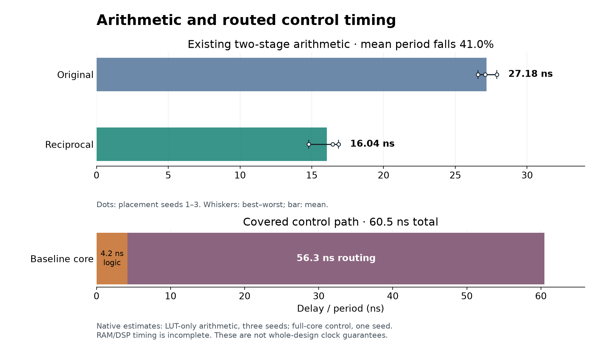

# Shortening arithmetic and control paths — 2026-09-24

Exact reciprocal rounding shortens the measured arithmetic path without changing results, pipeline depth or decoder cycles per step. It saves 448 LUTs and 28 FFs in the complete four-phi core. The native full-core baseline remains dominated by control routing. These measurements do **not** establish a usable board clock.

## Scope and baseline

The target is `xc7z030sbg485-1`, with the existing two-stage, II=1 XLS schedule. Small arithmetic probes keep every input/result bit in fabric registers; the complete core is the existing two-plane 2×1 phi workload with source schedulers, RAMs and reduction planes. Tools, sources, mapped-netlist digests and all samples are retained in [microprobes.json](timing-chains-2026-09-24/microprobes.json) and [cores.json](timing-chains-2026-09-24/cores.json). [Reproduction instructions](../timing_chains/README.md) describe the harness and mathematical proof.

Native RAM/registered-DSP timing is incomplete, DSP cascade arcs can be pessimistic, and speed-grade/clock modeling is unqualified. The main arithmetic comparison therefore disables DSP mapping, leaving covered FF/LUT/carry paths. DSP-mapped results are retained as secondary evidence. Whole-core partial-path results locate problems; they are not frequency guarantees. See [the endpoint audit](native-timing-coverage-2026-09-24.md).

## Arithmetic result

Period statistics below use the same three placement seeds (1–3). Variance is population variance in ns², not a confidence interval. The complete workload keeps its two-stage pipeline.

| LUT-only bulk recurrence | Mean ns | Variance ns² | Best ns | Worst ns | LUTs | FFs |
| --- | ---: | ---: | ---: | ---: | ---: | ---: |
| Original, combinational | 31.253 | 3.060 | 29.994 | 33.727 | 1,576 | 131 |
| Reciprocal, combinational | 22.635 | 0.154 | 22.080 | 22.920 | 956 | 131 |
| Original, two stages | 27.185 | 0.293 | 26.582 | 27.894 | 1,685 | 202 |
| **Reciprocal, two stages** | **16.044** | **0.810** | **14.793** | **16.872** | **1,018** | **200** |
| Reciprocal without saturation, two stages | 17.398 | 0.459 | 16.496 | 18.129 | 977 | 233 |

The accepted change reduces mean arithmetic period **41.0%** in the two-stage probe and **27.6%** combinationally. At matched seed 1, DSP mapping gives 36.98→28.50 ns and 243→205 LUTs, with six DSPs unchanged; the coarse DSP model limits that comparison. [Statistics](timing-chains-2026-09-24/statistics.json) retain individual samples and computed values.

For non-power-of-two divisors, `hls_fixed::round_ratio` now multiplies by a statically rounded reciprocal, adds the half-unit bias and shifts. Reciprocal precision is chosen so every representable input rounds exactly as before, including negative ties and the most negative value. Power-of-two divisors use widened signed-bias division. No extra stage or state is introduced.

## Experiments and rejections

Each hypothesis was recorded before its measurement; [the register](timing-chains-2026-09-24/hypotheses.md) retains expected effects. Source patches reproduce the arithmetic candidates against the baseline libraries with `patch -p1`; they are experimental inputs, not additional production implementations.

| Candidate | Prediction | Measured outcome and decision |
| --- | --- | --- |
| Signed bias instead of magnitude/sign restoration | 10–20% shorter | Whole bulk combinational path 30.04→25.46 ns at seed 1; useful intermediate. |
| Positive offset before division | A further 5–10% | Isolated quotient 20.32 ns versus signed bias 17.63; rejected. |
| Narrow numerator 37→36 bits | 5–10% shorter | Whole bulk 27.68 ns versus 25.46; rejected. |
| Factor /12 into /4 then /3 | 10–15% shorter | Whole bulk 28.44 ns; rejected. Magnitude variant also loses in the quotient probe. |
| Schedule the same two stages with ASAP7/SKY130 models | About 10% shorter | Both 21.11 ns versus unit model 20.84 on signed bias; rejected. ASIC models are scheduling heuristics here. |
| Exact reciprocal | 10–15% below signed bias | Accepted; strongest repeatable arithmetic improvement. |
| One fewer reciprocal bit for even divisors | About 5% | Whole bulk 25.25 ns versus 22.90, with more LUTs; rejected. |
| Remove redundant bulk saturation | Save 1–2 ns | Combinational mean improves to 19.85 ns, but two-stage mean worsens 8.4%; rejected. |
| Register both reduction-batch queues | Shorten executor→reduction path by at least 25% | Correctness passes, but cycles/step rise 93.25→107.25; rejected before spending time on routing. |
| Split reciprocal into parallel partial products | Another 10–20% | Two-stage LUT-only mean 15.16 ns (5.5% better), but 1,660 LUTs versus 1,018; DSP mapping has the same six DSPs, more LUTs and no delay gain. Retained as an experiment. |
| Replicate high-fan-out LUT drivers | 10–25% shorter routed control path | Stopped after 87 minutes with 2,268 conflicting wires remaining. Not adopted. |
| Gentler 25 MHz target and placement replay | Easier convergence, possibly 10% shorter covered control delay | Placement completes; routing still has 1,208 conflicts at the 60-minute total budget. No frequency result. |
| Add a third pipeline stage, retaining II=1 | 20–30% shorter arithmetic stage, ideally unchanged step cadence | Seed-1 arithmetic worsens 16.87→18.15 ns; whole-core cycles/step rise 93.25→123.25 (123.33 with stalls). Rejected. |

The current source reproduces the reciprocal probe; generated RTL differs only in internal signal identifiers. The saturation result is significant: a simpler combinational expression need not produce a better partition across existing pipeline stages. The accepted implementation retains saturation.

## Complete-core timing

The new matched baseline reports **16.52 MHz / 60.5 ns**, with **4.2 ns logic and 56.3 ns routing**. Its reported worst path crosses executor output, bypassing queues, scheduler routing and the reduction plane. One final 102-load control net contributes 14.2 ns. Both path endpoints are fabric registers; this particular path does not traverse the omitted RAM/DSP register boundaries. [Detailed path](timing-chains-2026-09-24/board-route-baseline-paths.json).

The [last placed-and-routed report](lut-legality-2026-09-21.md) also reported 16.52 MHz for this board-sized Z7030 geometry (3.9 ns logic / 56.6 ns routing). The current matched rebuild is the comparison authority: changes in mapped logic or tool inputs can move placement even when application behavior is identical. Historical Z7100 D3 results use a different workload and device.

The reciprocal core maps to **33,256 LUTs, 29,451 FFs, 56 DSPs, 44 RAMB18 and eight RAMB36**; baseline is 33,704 LUTs and 29,479 FFs with the same DSP/RAM counts. The separate replication experiment starts from the original core and adds 690 identical LUT drivers (2.05%). It changes neither registers nor latency; exact wire-alias substitution recovers the original circuit.

The arithmetic candidate at the same 100 MHz target did not complete routing within a 90-minute wall-clock budget: 921 conflicting wires remained after 21 router iterations. No candidate frequency is reported for that run; neither an improvement nor a regression in complete-core timing has been established. The identical candidate netlist at a gentler 25 MHz target completed placement but not routing within a 60-minute total budget: 1,208 conflicting wires remained after 15 iterations. The placement checkpoint is retained for future router investigations. Replay restarts the router RNG; it is a different optimization sequence, not an isolated change to the frequency constraint.

## Correctness and throughput

[Simulation evidence](timing-chains-2026-09-24/simulation.json) records unchanged accepted outputs and cycles per step: board-sized **93.25**, D3 **180.00**, and D3 with output stalls **181.9583**. The complete D3 implementations also match every public output cycle through 12,000 cycles, long stalls and reset: 639 X and 626 Z frames compared, with identical stalled-cycle counts. These are functional cycle measurements, not physically achieved clock rates. [The cycle-comparison manifest](timing-chains-2026-09-24/cycle-comparison.json) retains the exact compiler options and source/tool digests.

The DSLX tests exhaust eight-bit inputs for twelve divisors, check widths through 129 bits and run 10,000 sampled wide-input JIT comparisons. [Z3 evidence](timing-chains-2026-09-24/rounding-proofs.json) proves the integer rounding identity for all inputs in 110 width/divisor combinations; incorrect reciprocal rounding must produce a counterexample. It also proves the rejected saturation optimization's four-neighbor range bound. These arithmetic proofs do not claim compiler equivalence.

Local EUnit passes **1,151 tests**; Dialyzer passes. Timing-tool tests pass **36 tests, one skipped**. Source contracts introduce no new gaps. [Check records](timing-chains-2026-09-24/checks.json) retain log digests. CI now explicitly executes the fixed-point properties with JIT comparison and a fixed random seed.

The pinned Linux suite passes its functional, D3 memory/debug, bring-up and mixed-topology checks. Its changed phi RTL digest is refreshed from [the Linux artifact](timing-chains-2026-09-24/linux-goldens.json); the other three RTL and all seven DSLX goldens are unchanged. The complete golden check and 1,151 EUnit tests pass again locally after the refresh.
