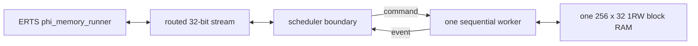

# Phi scheduler and state-storage experiment

This directory contains the implementation ablations used to locate the area
cost of the generated distance-three phi-decoder. They are executable
experiments, not backend components or reusable example APIs.

The files answer three progressively narrower questions:

1. How small can the fixed distance-three experiment become when actor and
   mailbox semantics are replaced by one globally scheduled RTL machine?
2. How much of the remaining XLS design is arithmetic, and how much is
   replicated actor state?
3. Can a time-multiplexed worker keep its state in one inferred block RAM and
   still service the same routed ERTS protocol?

The experiment keeps the application boundary honest: the raw and BRAM
implementations accept the same cutoff, correction-update, and measurement
query packets as the generated topology. Their bridge runs use the unchanged
`phi_memory_runner` and compare every ordered correction and every final data
qubit with a witness produced by the CPU actor deployment.

## Implementations

- `phi_memory_raw_d3.sv` is a fixed-size handwritten SystemVerilog baseline.
  It uses one global schedule and one restoring divider.
- `phi_relax_lane.x` and `phi_relax_bank.sv` isolate the Q15.16 relaxation
  datapath and its spatial/temporal replication curve.
- `phi_sequential_core.x` is the same global schedule expressed in DSLX, with
  state held in register arrays.
- `phi_sequential_bram_core.x` moves the sequential worker's ten-word spatial
  records behind an XLS 1RW RAM interface.
- `phi_memory_scheduler_boundary.sv` and `phi_memory_bram_top.sv` adapt that
  worker to the routed 32-bit application protocol.



## Results

The current out-of-context XC7 mappings are:

| implementation | estimated logic cells | flip-flops | LUT1-LUT6 | `RAM32M` | `RAMB18E1` | `DSP48E1` |
| --- | ---: | ---: | ---: | ---: | ---: | ---: |
| raw SystemVerilog with boundary | 2,063 | 708 | 2,358 | 148 | 0 | 0 |
| register-array DSLX core | 9,065 | 4,525 | 9,495 | 0 | 0 | 1 |
| initial one-RAM DSLX core | 1,248 | 890 | 1,755 | 0 | 1 | 1 |
| interactive one-RAM worker with boundary | 1,723 | 1,293 | 2,319 | 0 | 1 | 1 |

These are mapping results, not placement, routing, or timing closure. The
scopes also differ slightly: the initial one-RAM row was a summary-only worker,
while the interactive row includes its real command/event interface and routed
adapter. Moving the spatial state behind the RAM port removed 7,817 estimated
logic cells and 3,635 flip-flops from the register-array DSLX result.

The direct BRAM protocol regression takes 175,408 clocks. It checks the ordered
84-correction trace, the 45/39 X/Z split, and all 18 final measurement replies.
The ERTS/VPI run matches the complete CPU witness and takes about 151 seconds on
the current local UTM.

The relaxation sweep shows the explicit area/latency control available by
replicating only the arithmetic worker:

| relaxation lanes | estimated logic cells | estimated diffusion clocks |
| ---: | ---: | ---: |
| 1 | 889 | 2,772 |
| 2 | 1,774 | 1,386 |
| 4 | 3,554 | 770 |
| 9 | 8,015 | 308 |
| 18 | 15,997 | 154 |

The principal result is therefore not that all actors should be collapsed into
one machine. It is that actor implementation lanes and actor state count need
not scale together. A generated deployment can choose several workers, assign
many logical instances to each, and keep their distinct states in RAM.

## Running the experiment

The fast local checks are:

```sh
experiments/08-phi-scheduler/run_raw_rtl.sh
experiments/08-phi-scheduler/run_relax_bank.sh
```

The following commands use the configured XLS build host and local XC7 tools:

```sh
experiments/08-phi-scheduler/run_relax_xls.sh
experiments/08-phi-scheduler/synth_relax_sweep.sh
experiments/08-phi-scheduler/run_sequential_xls.sh
experiments/08-phi-scheduler/run_bram_xls.sh
experiments/08-phi-scheduler/run_area_matrix.sh
```

The complete ERTS/VPI comparisons are:

```sh
experiments/08-phi-scheduler/run_raw_demo.sh
experiments/08-phi-scheduler/run_bram_demo.sh
```

The defaults use `192.168.64.7`; the usual `ERL_HLS_REMOTE_*` variables select
another staging host and XLS installation.

## Deliberately missing semantics

The sequential machines do not implement independent actor scheduling,
mailboxes, lifecycle generations, or arbitrary topology. They compute every
move from a common snapshot and serialize all events. A real shared-actor
backend must preserve logical actor identity and bounded mailbox behavior while
making the number of implementation lanes a physical deployment choice.

The current RAM indices already separate the X and Z decoder planes. A useful
next experiment could therefore run a data/noise owner and two decoder workers
in parallel, meeting at a round barrier. Splitting a plane spatially is also
possible, but would require halo exchange after each Jacobi pass.
