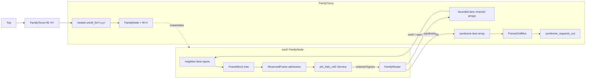
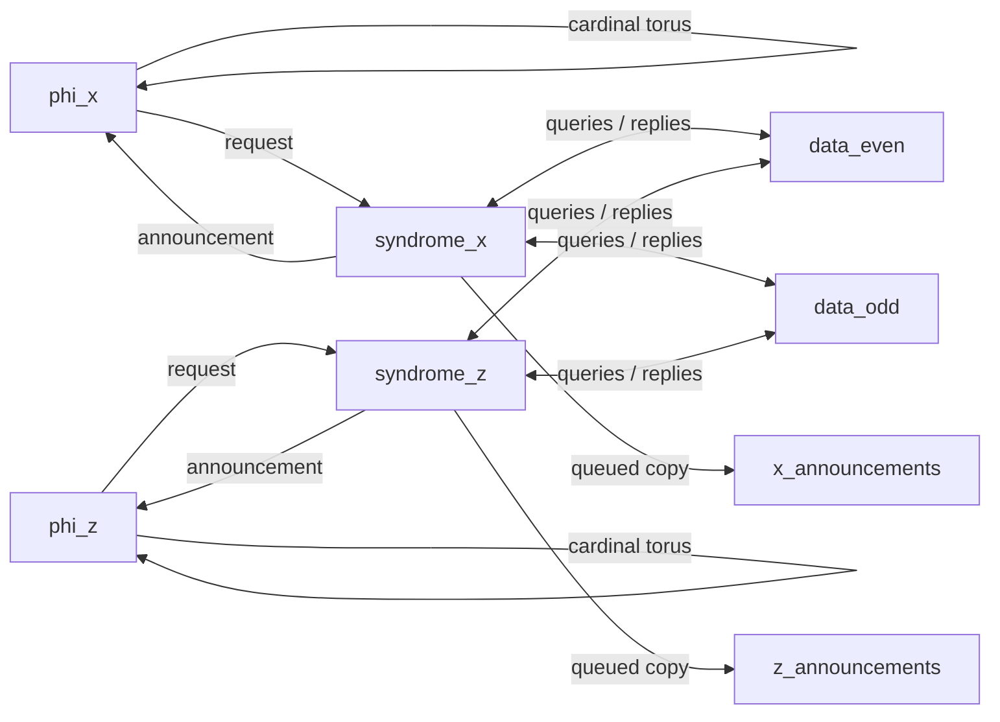

# Generated phi/noise topology

This deliberately small fixture connects one phi cell, one phenomenological
syndrome cell, and one phenomenological data cell. Its sources are split by
responsibility:

- `phi_phenom_topology.erl` declares actors, exact routes, startup messages,
  and the observable output as ordinary Erlang data.
- `phi_phenom_topology_dslx.erl` declares temporary physical choices for this
  executable fixture.
- `phi_phenom_topology.x` is generated and checked in as a golden artifact.

Actors exchange complete `axis::Frame` values through depth-one network
queues. Startup prefixes configure the two noise actors before their first
routed input. Each actor drains its entry actions through one source-ordered
egress stream. A generated router then places each message in the queue for
its logical source/recipient lane. The syndrome announcement uses queued
fanout: the actor send completes at the common egress queue, after which its
router waits for both the phi and observation branch queues. Each actor
ingress ends at one mailbox-admission gate.

Startup quiescence is checked from each configured actor's statically known
initial phase and source-ordered entry-effect summary. Topology generation does
not execute actor callbacks.

The one-instance periodic topology makes four output ports of each actor
converge on one destination. All four ports now enter the same lane queue, so
their source order is preserved before that lane competes with other senders
at the destination ingress. The physical profile no longer needs an
alias-order exception. The current implementation conservatively serializes
all entry actions from an actor, including actions for different recipients.
The common egress is explicitly sized for that artifact's largest phase-entry
effect list, so the phi actors' four-frame bursts do not depend on incidental
mux-tree buffering before they can complete.

Logical actor IDs may be tuple-indexed values such as `{phi, X, Y}`; generated
channel names use canonical numeric instance indexes. In this exact backend,
external IDs also become DSLX port names and must therefore be DSLX
identifiers.

The generated-RTL regression runs consecutive decoder steps, stalls the
observation port, checks that a complete frame remains stable, then verifies
that the graph continues. Compiler-emitted actor summaries now check routed
schema membership and actor-to-actor layouts. Direct actor edges still require
equal local selectors because this backend does not yet generate tag remappers;
producers sharing an external output must agree on its selector and layout.
An additional generated-RTL fixture routes three distinguishable actions
written in the order 3, 1, 2 through one aliased external lane and verifies
that order while the lane is backpressured.

The closed-graph generator consumes an exact heterogeneous graph, so its proc
and channel instances are explicit. The compact torus plan below uses a
separate family backend that retains regular structure instead of flattening a
large grid globally.

## Compact torus witness

`phi_torus_topology.erl` is the first rule-preserving family plan. It declares
one bounded rectangular `phi_halo_cell` family and five route relations: four
wrapped cardinal translations and one external syndrome-request stream. A
5-by-5 plan and a 50-by-50 plan therefore contain the same one family and five
rules; only the shape and derived instance count differ.

The generated proc hierarchy is:

`FamilyTorus` and `FamilyNode` each appear once in generated source. XLS
elaboration instantiates one node, service, router, admission gate, and ingress
mux tree per coordinate. The lane arrays connect those instances without an
expanded global route table. `FrameGridMux` is only the scalar observation
boundary; it is not on the cardinal mesh paths.

The topology normalizer validates every family output and route interface once
per rule. `hls_topology:routes_for_instance/3` resolves selected coordinates for
boundary tests without constructing a global actor or route list. On a 2-by-2
torus it also exposes the genuine north/south and east/west lane aliases; the
family backend maps each aliased pair to one channel array, reusing the ordered
actor egress rather than merging the ports again at the receiver.

The generated DSLX contains one reusable family node and nested `unroll_for!`
spawns over two-dimensional channel arrays. A 5-by-5 and a 50-by-50 torus have
the same generated source structure; XLS still elaborates the required actor
and queue resources for every coordinate. Runtime channel-array indexing is
not supported by the pinned XLS build, so the scalar syndrome-request boundary
uses statically indexed unrolled receives gated by a round-robin cursor. This
polling merge is bounded and fair but not work-conserving: each family member
gets one turn per `Width * Height` completed activations. The default rectangular
2-by-3 fixture is compiled to RTL and verifies all six initial requests, stable
backpressure, and no duplication.

A preliminary out-of-context Yosys 0.63 `synth_xilinx` run for xc7 on that
2-by-3 RTL reports about 30,833 estimated logic cells, 33,864 flip-flops, 24
DSP48E1s, and no block RAM. This is an architectural warning, not a fit result:
it has neither placement nor timing constraints, and the current 128-bit
depth-one queues are implemented in registers. The six actor services account
for roughly 19,242 of the estimated logic cells; queue representation is
therefore the other obvious target before scaling the witness.

This single-family witness still does not model the syndrome/data-cell geometry
or a production-throughput external merge.

## Nondegenerate phi/noise geometry

`phi_noise_topology.erl` adds the first nondegenerate periodic decoder geometry.
It uses six `Distance`-by-`Distance` families:
`phi_x`, `phi_z`, `syndrome_x`, `syndrome_z`, `data_even`, and `data_odd`.
`data_even[X,Y]` and `data_odd[X,Y]` represent physical data coordinates
`[X,2Y]` and `[X,2Y+1]`. That parity split turns every cardinal neighborhood
into an ordinary wrapped translation between equal-shaped families, so the
current compact relation form needs no parity-dependent or affine index
language.

At the default distance three, the plan has 54 actor instances, 28 compact
route relations, and 36 explicit startup messages: one for every member of the
four noise families. The route-rule count is independent of distance; only the
family bounds and startup entries grow. Startup seeds are deterministic,
distinct, and nonzero. Queued fanout exposes one coordinate-free activity tap
for each syndrome plane. Because `phenom_anyon` does not carry the originating
family coordinate, those taps are useful for backpressure and liveness checks,
not for reconstructing or validating the full decoder state.

The present noise configuration is still a plumbing fixture. Its common high
threshold deliberately produces frequent binary events rather than modeling a
full Pauli channel, and every phi actor still uses the same fixed actor-local
seed. The explicit startup list also caps this example at distance 50; the
compact route representation itself has no such bound. Per-instance phi seeds,
coordinate-preserving observation, and a physically calibrated noise model
remain later decoder work.
