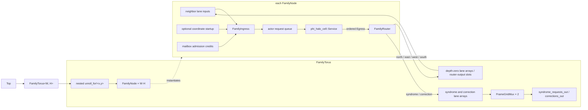
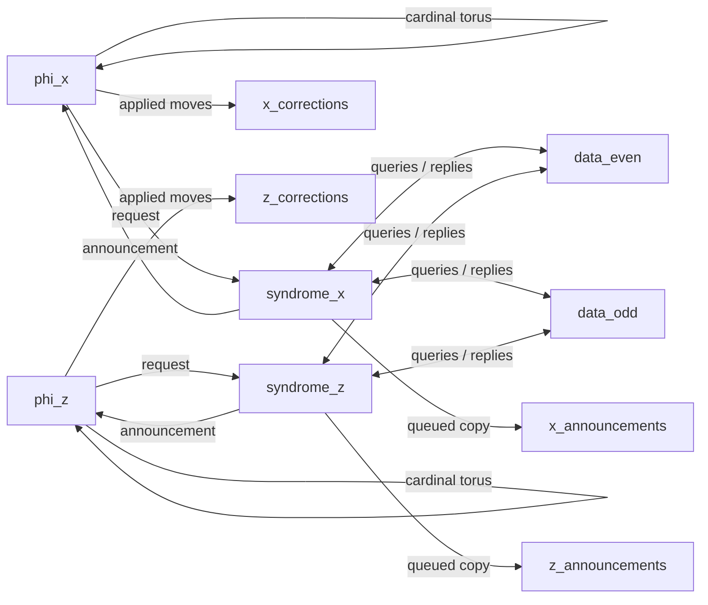

# Generated phi/noise topology

This deliberately small fixture connects one phi cell, one phenomenological
syndrome cell, and one phenomenological data cell. Its sources are split by
responsibility:

- `phi_phenom_topology.erl` declares actors, exact routes, startup messages,
  and observable outputs as ordinary Erlang data.
- `phi_phenom_topology_dslx.erl` declares temporary physical choices for this
  executable fixture.
- `phi_phenom_topology.x` is generated and checked in as a golden artifact.

Actors exchange complete `axis::Frame` values through depth-one network
queues. Startup prefixes configure the two noise actors before their first
routed input. Each actor drains its entry actions through one source-ordered
egress stream. A generated router then places each message in the queue for
its logical source/recipient lane. The syndrome announcement uses queued
fanout: the actor send completes at the common egress queue, after which its
router waits for both the phi and observation branch queues. Each actor
ingress ends at one mailbox-admission gate.

Startup quiescence is checked from each configured actor's statically known
initial phase and source-ordered entry-effect summary. Topology generation does
not execute actor callbacks.

The one-instance periodic topology makes four output ports of each actor
converge on one destination. All four ports now enter the same lane queue, so
their source order is preserved before that lane competes with other senders
at the destination ingress. The physical profile no longer needs an
alias-order exception. The current implementation conservatively serializes
all entry actions from an actor, including actions for different recipients.
The common egress is explicitly sized for that artifact's largest phase-entry
effect list, so the phi actors' five-slot flipping sequences do not depend on
incidental mux-tree buffering before they can complete.

Logical actor IDs may be tuple-indexed values such as `{phi, X, Y}`; generated
channel names use canonical numeric instance indexes. In this exact backend,
external IDs also become DSLX port names and must therefore be DSLX
identifiers.

The generated-RTL regression runs consecutive decoder steps, stalls the
observation port, checks that a complete frame remains stable, then verifies
that the graph continues. Compiler-emitted actor summaries now check routed
schema membership and actor-to-actor layouts. Direct actor edges still require
equal local selectors because this backend does not yet generate tag remappers;
producers sharing an external output must agree on its selector and layout.
An additional generated-RTL fixture routes three distinguishable actions
written in the order 3, 1, 2 through one aliased external lane and verifies
that order while the lane is backpressured.

The closed-graph generator consumes an exact heterogeneous graph, so its proc
and channel instances are explicit. The compact torus plan below uses a
separate family backend that retains regular structure instead of flattening a
large grid globally.

### Topology input-flop area check

A one-flag out-of-context XC7 synthesis comparison of the exact one-cell
phi/noise fixture keeps producer output flops in both variants:

| consumer input flops | estimated logic cells | flip-flops | LUT1–LUT6 | `DSP48E1` |
| --- | ---: | ---: | ---: | ---: |
| enabled | 8,860 | 9,417 | 9,834 | 4 |
| disabled | 8,273 | 7,887 | 9,390 | 4 |

Both variants come from the same optimized IR and use the pinned XLS build and
the experiment-local openXC7 Yosys. This is an area-only synthesis result; it
does not establish placement, routing, or timing closure.

## Compact torus witness

`phi_torus_topology.erl` is the first rule-preserving family plan. It declares
one bounded rectangular `phi_halo_cell` family and six route relations: four
wrapped cardinal translations, one external syndrome-request stream, and one
external correction-decision stream. A 5-by-5 plan and a 50-by-50 plan
therefore contain the same one family and six rules; only the shape and derived
instance count differ.

The generated proc hierarchy is:

`FamilyTorus`, `FamilyNode`, and `FamilyIngress` each appear once in generated
source. XLS elaboration instantiates one node, service, router, integrated
ingress, and actor request queue per coordinate. The ingress retains one
mailbox credit while fairly polling its statically known input lanes, then
transfers one complete frame and consumes the credit. For configured families,
the same ingress sends the coordinate startup frame under the first credit
before polling routed traffic. This replaces the earlier buffered `FrameMux2`
tree, `StartupPrefix`, and separate `ReservedFrame` process without changing
the actor mailbox boundary or adding another input queue. `FrameGridMux`
appears only at the scalar observation boundaries; it is not on the cardinal
mesh paths.

The topology normalizer validates every family output and route interface once
per rule. `hls_topology:routes_for_instance/3` resolves selected coordinates for
boundary tests without constructing a global actor or route list. On a 2-by-2
torus it also exposes the genuine north/south and east/west lane aliases; the
family backend maps each aliased pair to one channel array, reusing the ordered
actor egress rather than merging the ports again at the receiver.

The generated DSLX contains one reusable family node and nested `unroll_for!`
spawns over two-dimensional channel arrays. A 5-by-5 and a 50-by-50 torus have
the same generated source structure; XLS still elaborates the required actor
and queue resources for every coordinate. Runtime channel-array indexing is
not supported by the pinned XLS build, so each scalar external boundary uses
statically indexed unrolled receives gated by a round-robin cursor. These
polling merges are bounded and fair but not work-conserving: each family member
gets one turn per `Width * Height` completed activations. The default
rectangular 2-by-3 fixture is compiled to RTL and verifies all six initial
requests, stable backpressure, and no duplication. Its correction stream stays
idle because this structural witness has no syndrome source to advance the
actors.

The lane arrays explicitly declare depth zero. This supplies the pinned block
stitcher's per-channel FIFO metadata without installing a global default which
could mask another unannotated channel. The adapter is zero-capacity and
bypassing; synthesis removes its 128-bit storage and most of its controller
state. Codegen disables implicit consumer input flops and retains one registered
producer output for every router lane. That output stage is the lane's one
bounded holding slot and timing boundary. Placing the pinned materialized
depth-one FIFO used here after it would double-buffer the route and allocate two
additional 128-bit storage words. Actor request, admission, egress, and
external-merge queues remain explicit.

This single-family witness still does not model the syndrome/data-cell geometry
or a production-throughput external merge.

## Nondegenerate phi/noise geometry

`phi_noise_topology.erl` adds the first nondegenerate periodic decoder geometry.
It uses six `Distance`-by-`Distance` families:
`phi_x`, `phi_z`, `syndrome_x`, `syndrome_z`, `data_even`, and `data_odd`.
`data_even[X,Y]` and `data_odd[X,Y]` represent physical data coordinates
`[X,2Y]` and `[X,2Y+1]`. That parity split turns every cardinal neighborhood
into an ordinary wrapped translation between equal-shaped families, so the
current compact relation form needs no parity-dependent or affine index
language.

At the default distance three, the plan has 54 actor instances, 30 compact
route relations, and 36 explicit startup messages: one for every member of the
four noise families. The route-rule count is independent of distance; only the
family bounds and startup entries grow. Startup seeds are deterministic,
distinct, nonzero, and deliberately mixed so the first distance-three syndrome
plane is not spatially uniform.

Each syndrome announcement carries its `{X, Y}` coordinate; the external port
identifies the X or Z plane. Each phi cell retains that coordinate and may emit
one `phi_correction` decision after its four anyon-move actions for the step.
The plane, syndrome coordinate, and selected direction together identify the
neighboring data-qubit edge; the single event stream does not mean that a phi
cell is associated with only one data qubit.

The correction action is a statically placed `cast_if`: it retains its position
in the ordered entry-effect list, but its move predicate suppresses the frame
when no correction was applied. This matches the reference implementation's
sparse correction behavior, so traffic scales with corrections rather than
physical qubits and steps.

These `external` endpoints currently become output channels on the generated
DSLX `Top` proc. The RTL benches consume them directly. They are not yet wired
to `hls_fabric`, a PL-PS frame adapter, or an ERTS process; a deployment must
make that gateway and correction-application policy explicit.

The present noise configuration is still a plumbing fixture. Its common high
threshold deliberately produces frequent binary events rather than modeling a
full Pauli channel, and every phi actor still uses the same fixed actor-local
seed. The explicit startup list also caps this example at distance 50; the
compact route representation itself has no such bound. Per-instance phi seeds,
an explicit PL/host correction adapter, applying decisions to a data-qubit
correction history, and a physically calibrated noise model remain later
decoder work.

### Distance-three synthesis progression

Out-of-context XC7 mapping of the full nondegenerate graph gives:

| ingress | lane holding storage | consumer input flops | estimated logic cells | flip-flops | LUT1–LUT6 | `DSP48E1` |
| --- | --- | --- | ---: | ---: | ---: | ---: |
| buffered mux trees | router output + depth-one FIFO | enabled | 193,795 | 264,146 | 214,606 | 72 |
| integrated credit-aware | router output + depth-one FIFO | disabled | 153,843 | 156,920 | 173,480 | 72 |
| integrated credit-aware | router output | disabled | 135,199 | 111,416 | 153,265 | 72 |

Using the already-registered router output as the lane's only holding slot
removes 12.1% of the remaining estimated logic cells, 29.0% of the flip-flops,
and 11.7% of the LUTs. Relative to the original wrapper, the cumulative
reductions are 30.2%, 57.8%, and 28.6%. The full stalled-output distance-three
bench passes with the reduced lane capacity. The global producer-output-flop
policy cannot also be disabled: XLS detects the resulting combinational
request/admission cycle.

All rows use the same logical routing graph and actor artifacts; their physical
lane and ingress configurations differ as shown. These are area-only synthesis
results; they establish no part fit, placement, routing, or timing closure. The
final ABC map has logic depth 32 versus 33 for the preceding row, but that is
only a coarse technology-mapping metric.

### Distance-three RTL simulation

`tools/run_phi_noise_topology_sim.sh` is the opt-in full-graph regression. It
regenerates the distance-three DSLX, runs XLS conversion, optimization, and
Verilog generation on the configured build host, then compiles and runs
`phi_noise_topology_tb.sv` with Icarus. The cost is deliberately excluded from
the routine CI job.

The bench holds one announcement stream under backpressure, checks that its
frame remains stable, and leaves the other three outputs drainable. It then
accepts announcements in arbitrary merge order and requires every coordinate
from both planes in steps zero through two, proving that steps zero and one
completed everywhere. The current deterministic fixture also produces four
sparse step-one corrections per plane; the bench compares those as
coordinate/direction sets rather than as one globally ordered trace. Those
sets are regression goldens for this fixture, not a logical-correctness or
winding test.

On the 4-core, 8-GiB UTM using the pinned XLS build, the first run measured
about 15 seconds and 195 MiB for DSLX conversion, 3 minutes 51 seconds and
2.3 GiB for optimization, 52 seconds and 299 MiB for code generation,
25 seconds and 456 MiB for Icarus compilation, and 60 seconds and 142 MiB for
simulation. The generated Verilog is about 9.9 MB and 166,000 lines. These are
host build costs, not an FPGA utilization estimate; the runner saves compact
timing and digest reports but does not copy that Verilog into the repository.
