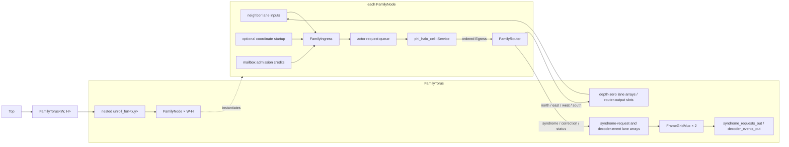
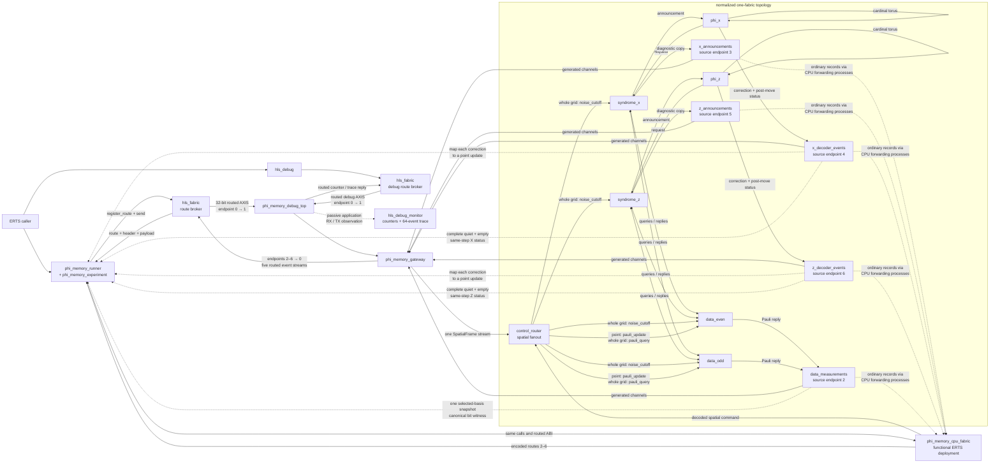
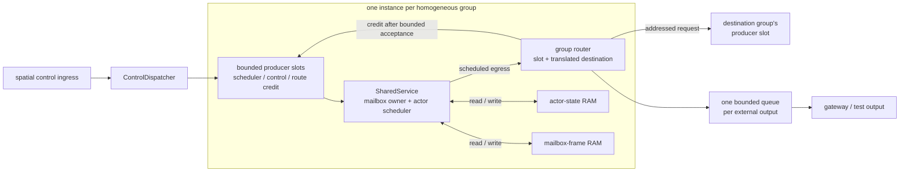

# Generated phi/noise topology

This deliberately small fixture connects one phi cell, one phenomenological
syndrome cell, and one phenomenological data cell. Its sources are split by
responsibility:

- `phi_phenom_topology.erl` declares actors, exact routes, startup messages,
  and observable outputs as ordinary Erlang data.
- `phi_phenom_topology_dslx.erl` declares temporary physical choices for this
  executable fixture.
- `phi_phenom_topology.x` is generated and checked in as a golden artifact.

Actors exchange complete `axis::Frame` values through depth-one network
queues. Startup prefixes configure the two noise actors before their first
routed input. Each actor drains its entry actions through one source-ordered
egress stream. A generated router then places each message in the queue for
its logical source/recipient lane. The syndrome announcement uses queued
fanout: the actor send completes at the common egress queue, after which its
router waits for both the phi and observation branch queues. Each actor
ingress ends at one mailbox-admission gate.

Startup quiescence is checked from each configured actor's statically known
initial phase and source-ordered entry-effect summary. Topology generation does
not execute actor callbacks.

The one-instance periodic topology makes four output ports of each actor
converge on one destination. All four ports now enter the same lane queue, so
their source order is preserved before that lane competes with other senders
at the destination ingress. The physical profile no longer needs an
alias-order exception. The current implementation conservatively serializes
all entry actions from an actor, including actions for different recipients.
The common egress is explicitly sized for that artifact's largest phase-entry
effect list. Its registered producer slot and FIFO therefore retain the phi
actors' five-action flipping sequences without depending on incidental
mux-tree buffering before they can complete.

Logical actor IDs may be tuple-indexed values such as `{phi, X, Y}`; generated
channel names use canonical numeric instance indexes. In this exact backend,
external IDs also become DSLX port names and must therefore be DSLX
identifiers.

The generated-RTL regression runs consecutive decoder steps, stalls the
observation port, checks that a complete frame remains stable, then verifies
that the graph continues. Compiler-emitted actor summaries now check routed
schema membership and actor-to-actor layouts. Direct actor edges still require
equal local selectors because this backend does not yet generate tag remappers;
producers sharing an external output must agree on its selector and layout.
An additional generated-RTL fixture routes three distinguishable actions
written in the order 3, 1, 2 through one aliased external lane and verifies
that order while the lane is backpressured.

The closed-graph generator consumes an exact heterogeneous graph, so its proc
and channel instances are explicit. The compact torus plan below uses a
separate family backend that retains regular structure instead of flattening a
large grid globally.

### Topology input-flop area check

A one-flag out-of-context XC7 synthesis comparison of the exact one-cell
phi/noise fixture keeps producer output flops in both variants:

| consumer input flops | estimated logic cells | flip-flops | LUT1–LUT6 | `DSP48E1` |
| --- | ---: | ---: | ---: | ---: |
| enabled | 8,860 | 9,417 | 9,834 | 4 |
| disabled | 8,273 | 7,887 | 9,390 | 4 |

Both variants come from the same optimized IR and use the pinned XLS build and
the experiment-local openXC7 Yosys. This is an area-only synthesis result; it
does not establish placement, routing, or timing closure.

## Compact torus witness

`phi_torus_topology.erl` is the first rule-preserving family plan. It declares
one bounded rectangular `phi_halo_cell` family and seven route relations: four
wrapped cardinal translations, one external syndrome-request stream, and the
correction and status outputs which share one external decoder-event stream. A
5-by-5 plan and a 50-by-50 plan therefore contain the same one family and seven
rules; only the shape, derived instance count, and explicit per-coordinate
startup constants differ. The v0
startup representation enumerates one deterministic, nonzero phi coin seed per
member; it is not yet a compact instance-constant formula.

The generated proc hierarchy is:



`FamilyTorus`, `FamilyNode`, and `FamilyIngress` each appear once in generated
source. XLS elaboration instantiates one node, service, router, integrated
ingress, and actor request queue per coordinate. The ingress retains one
mailbox credit while fairly polling its statically known input lanes, then
transfers one complete frame and consumes the credit. For configured families,
the same ingress sends the coordinate startup frame under the first credit
before polling routed traffic. This replaces the earlier buffered `FrameMux2`
tree, `StartupPrefix`, and separate `ReservedFrame` process without changing
the actor mailbox boundary or adding another input queue. `FrameGridMux`
appears only at the scalar observation boundaries; it is not on the cardinal
mesh paths.

The topology normalizer validates every family output and route interface once
per rule. `hls_topology:routes_for_instance/3` resolves selected coordinates for
boundary tests without constructing a global actor or route list. On a 2-by-2
torus it also exposes the genuine north/south and east/west lane aliases; the
family backend maps each aliased pair to one channel array, reusing the ordered
actor egress rather than merging the ports again at the receiver.

The generated DSLX contains one reusable family node and nested `unroll_for!`
spawns over two-dimensional channel arrays. With instance startup omitted, a
5-by-5 and a 50-by-50 torus have the same generated routing structure; the
operational fixture additionally emits one startup match arm per coordinate.
XLS still elaborates the required actor and queue resources for every
coordinate. Runtime channel-array indexing is not supported by the pinned XLS
build, so each scalar external boundary uses statically indexed unrolled
receives gated by a round-robin cursor. These polling merges are bounded and
fair but not work-conserving: each family member gets one turn per
`Width * Height` completed activations. The default rectangular 2-by-3 fixture
is compiled to RTL and verifies all six post-configuration initial requests,
stable backpressure, and no duplication. Its decoder-event stream stays idle
because this structural witness has no syndrome source to advance the actors.

The lane arrays explicitly declare depth zero. This supplies the pinned block
stitcher's per-channel FIFO metadata without installing a global default which
could mask another unannotated channel. The adapter is zero-capacity and
bypassing; synthesis removes its 128-bit storage and most of its controller
state. Codegen disables implicit consumer input flops and retains one registered
producer output for every router lane. That output stage is the lane's one
bounded holding slot and timing boundary. Placing the pinned materialized
depth-one FIFO used here after it would double-buffer the route and allocate two
additional 128-bit storage words. Actor request, admission, egress, and
external-merge queues remain explicit.

This single-family witness still does not model the syndrome/data-cell geometry
or a production-throughput external merge.

## Nondegenerate phi/noise geometry

`phi_noise_topology.erl` adds the first nondegenerate periodic decoder geometry.
It uses six `Distance`-by-`Distance` families:
`phi_x`, `phi_z`, `syndrome_x`, `syndrome_z`, `data_even`, and `data_odd`.
`data_even[X,Y]` and `data_odd[X,Y]` represent physical data coordinates
`[X,2Y]` and `[X,2Y+1]`. That parity split turns every cardinal neighborhood
into an ordinary wrapped translation between equal-shaped families, so the
current compact relation form needs no parity-dependent or affine index
language.



At the default distance three, the plan has 54 actor instances, 34 compact
route relations, and 54 explicit startup messages: one for every actor. The
route-rule count is independent of distance; only the family bounds and startup
entries grow. PRNG seeds are deterministic, distinct, and nonzero across all
six families. The noise seeds are deliberately mixed so the first
distance-three syndrome plane is not spatially uniform.

Each syndrome announcement carries its `{X, Y}` coordinate; the external port
identifies the X or Z plane. Announcements are diagnostic and do not close an
experiment. They are nevertheless lossless branches of the syndrome-to-phi
fanout, so a runner must drain both streams continuously or it will stall the
decoder. Each phi cell retains that coordinate and may emit one
`phi_correction` after its four anyon-move actions for the step, followed by a
`phi_status` reporting occupancy and propagated noise-quiet state. Correction
and status share one plane boundary, which preserves each source cell's order
while leaving cross-cell merge order unspecified. The plane, syndrome
coordinate, and selected direction together identify the neighboring data-
qubit edge; the single event stream does not mean that a phi cell is associated
with only one data qubit.

The correction action is a statically placed `cast_if`: it retains its position
in the ordered entry-effect list, but its move predicate suppresses the frame
when no correction was applied. This matches the reference implementation's
sparse correction behavior, so traffic scales with corrections rather than
physical qubits and steps.

Each data actor retains one cumulative projective Pauli containing both
physical errors and applied decoder corrections. The current binary noise event
is Y because it is visible to both syndrome planes; two such events cancel.
After cutoff, `pauli_query` asks whether that frame anticommutes with a requested
Pauli measurement. This operation nondestructively inspects the simulator's
classical accumulator; the physical memory protocol uses it for only one basis
before reset. The reply carries a request ID, physical data coordinate, and
parity bit. Both data families share one fairly merged output; request IDs and
coordinates make its unspecified cross-family order irrelevant.

These `external` endpoints remain five typed channels on the generated
topology, but `phi_memory_gateway` now merges them into distinct routed source
endpoints. `hls_fabric` registers all five routes to one `phi_memory_runner`,
which decodes their records and feeds the pure reducer. Route identity supplies
the plane or measurement-stream identity that is deliberately absent from the
actor payload. `phi_memory_boundary` derives this canonical output order, the
endpoint allocation shown in the diagram, and each selector and packed width
from the compact topology and generated actor codecs; the host wire codec and
DSLX gateway generator consume the same contract.

`phi_memory_cpu_fabric` is the example-local realization of that same compact
plan. It starts every family member as a disconnected `hls_statem`, resolves
each member's routes from the normalized relations, and groups output ports
with the same recipients behind one forwarding process. It queues all startup
messages and the first cutoff before connecting data and syndrome actors, then
phi actors; the decoder therefore cannot outrun the command which closes its
noise epoch. Rectangle delivery uses the normalized ingress embeddings rather
than a second copy of the checkerboard geometry.

The CPU realization accepts the same `register_route` and `send` calls as
`hls_fabric`, and decodes commands and encodes events through
`phi_memory_wire`. The runner and reducer are consequently unchanged between
CPU and transported deployments. Its actor and forwarding mailboxes are
ordinary Erlang mailboxes, however: this is a functional reference for the
current topology subset, not a model of bounded network backpressure, physical
fanout completion, reset, or admission.

Host commands use destination endpoint 1. Their boundary frame has four
payload words: a full-width prefix of four little-endian `u16` rectangle bounds
followed by one or two actor payload words. The generator therefore selects
`axis::FrameN<4>` for the current contract; the capacity follows the widest
declared command rather than being a global `axis::Frame` limit. This wider
boundary does not change the three-word actor ABI. The gateway validates the
route, boundary version, message length, rectangle, and target-specific payload
before constructing the ordinary actor frame. Its first valid command also
supplies a one-shot egress activation token, so topology output cannot escape
before the host has installed its routes.

The generated gateway contains only that phi-specific validation, output
selection, and topology composition. It imports route-envelope ingress, the
activation gate, and frame serialization from `hls_fabric_router.x`; those
transport procs are shared with other fabric boundaries rather than repeated
as a static block in the Erlang generator.

`phi_memory_debug_top` wraps that generated gateway with the same passive
monitor used by the smaller `regsvc` example. A second `hls_fabric` owns the
independent debug stream and routes requests to monitor endpoint one. The
distance-one and distance-three ERTS/Icarus bridge tests issue live counter and
trace requests, decode populated maps, require observed application traffic in
both directions, and reject any passive-observation drop. The trace is attached
outside the application route-envelope decoder, so it describes physical
routed packets rather than actor selectors, mailbox admission, coordinates, or
state transitions. This is a useful boundary-health apparatus, not yet a
semantic actor debugger.

An out-of-context XC7 mapping of the generated distance-one gateway measured
the constant boundary cost with `synth_xilinx -flatten -abc9 -noiopad`:

| boundary | estimated logic cells | flip-flops | LUT1–LUT6 | `RAMB36E1` | `DSP48E1` |
| --- | ---: | ---: | ---: | ---: | ---: |
| application gateway | 19,033 | 16,393 | 21,732 | 0 | 16 |
| gateway + routed debug monitor | 20,207 | 18,665 | 22,975 | 2 | 16 |

The monitor adds 1,174 estimated logic cells (6.2%), 2,272 flip-flops (13.9%),
1,243 LUTs (5.7%), and two block RAMs, with no additional DSPs. The two trace
banks account for the block RAMs. This is an exact distance-one boundary A/B;
the monitor is instantiated once per gateway, so these numbers should not be
multiplied by the actor count or presented as a mapped distance-three result.

The one application ingress is the externally addressed `control_router`
service. Its envelope contains an ordinary actor frame plus an internal target
and inclusive rectangle. `noise` selects all noise actors, while `data`
selects data actors for Pauli queries or correction updates. Coordinates name
stable logical services, like registered process names, rather than actor
incarnations; one broadcast may therefore straddle lifecycle churn. The
present whole-topology reset flushes router and actor traffic together.
Independent restart will need lifecycle-owned flushing or generation checks at
the leaves.

A malformed routed packet is drained without actor delivery so the receiver
can accept the next packet in sync. The present boundary has no trustworthy
operation identity or reserved error path for every malformed packet, so this
case ends at the runner timeout. A later typed protocol-fault sideband should
close the owning connection; actual transport-process failure already reaches
the runner through its `hls_fabric` monitor as `{fabric_down, Reason}`.

The current physical lowering uses one lossless, statically unrolled
distributor per family. It finishes the selected family sends before accepting
another envelope, but top-level router acceptance is bounded network admission,
not simultaneous actor-mailbox admission. The gateway validates rectangle
bounds and target/schema combinations before this point. Pauli updates are
at-most-once: a malformed frame, transport failure, reset, or timeout aborts
the experiment, and retry will require an explicit operation identity and
bounded duplicate suppression.

`hls_spatial_router.x` also defines tested pair, quadrant, and leaf building
blocks for a later generated tree inside one fabric. Neither implementation
defines how a global rectangle is partitioned, addressed, or retried across
multiple FPGAs. A multi-FPGA adapter must intersect the rectangle with each
local partition and re-originate explicitly addressed per-fabric commands;
partial delivery and failure semantics remain unresolved.

`phi_memory_experiment` is the example-local, pure ERTS reducer for closing one
memory experiment. It first sends a whole-grid cutoff. Every data reply then
propagates its persistent quiet bit through the syndrome announcement and phi
status. The reducer translates each sparse correction into a point-addressed
`pauli_update` immediately. A complete same-step status set from both decoder
planes closes the decoder only when every coordinate is quiet and empty.
Because each cell's status follows its optional correction on the same ordered
plane output, the two complete sets also fence all earlier correction events.
The reducer then issues one whole-data-grid `pauli_query` in the caller-selected
basis after the queued point updates. The canonical result records the common
closeout step, every coordinate's anticommutation bit, the sorted correction
set, and the parity of the selected horizontal row. A complementary-basis
measurement requires reset and a separate run; sequential X and Z queries
would not describe one physical shot. This is a sound completion witness, not
a liveness guarantee: the current fixed-round decoder can leave symmetric
nonempty anyon configurations stationary. Until its tie-breaking or stopping
rule is
strengthened, the ERTS runner must bound the closeout wait and report
nonconvergence rather than inferring completion from elapsed time. This first
protocol assumes one lossless, non-restarting fabric activation; a reset or
gateway failure aborts the experiment rather than invoking unspecified retry
behavior.

The present distance-three noise configuration is still a plumbing fixture.
Its common high noise rate deliberately produces frequent binary events rather
than modeling a full Pauli channel. That rate is encoded as the `u32` threshold
used by each cell's Bernoulli comparison. The explicit startup list also caps
this example at distance 50; the compact route representation itself has no
such bound. The direct VPI bridge now transports the reducer's ordered commands
and the five routed output streams in simulation. The real DMA `axismsg` driver
still expects its older unrouted frame boundary and must be adapted before this
gateway can be used on a PS/PL link. A physically calibrated noise model remains
later decoder work.

### Ordered-egress capacity experiment

Actor actions share one serialized egress. On an initially empty path, the
`burst` policy sizes its FIFO so that the FIFO and XLS's registered producer
output can hold the actor's largest phase-entry action list. This relies on the
repository code generators retaining `--flop_outputs=true`. Literal profile
values select a uniform FIFO depth for experiments.

An out-of-context d=2 XC7 comparison measured the actor-egress alternatives
with consumer input flops disabled and producer output flops enabled:

| actor-egress FIFO | estimated logic cells | flip-flops | LUT1–LUT6 | `DSP48E1` |
| --- | ---: | ---: | ---: | ---: |
| previous FIFO-only sizing: 4 for data/syndrome, 5 for phi | 69,801 | 57,634 | 92,258 | 512 |
| burst accounting for the producer slot: 3 and 4 | 68,688 | 55,489 | 90,872 | 512 |
| uniform depth one | 65,276 | 50,499 | 88,090 | 512 |

Accounting for the existing producer slot reduces the conservative row by
1.6% of estimated logic cells, 3.7% of flip-flops, and 1.5% of LUTs without
reducing its initially empty burst capacity. Uniform depth one reduced the
counts further, but neither it nor uniform depth zero reached quiet decoder
status in the d=1 smoke bench within 200,000 cycles. The selected burst policy
passed that bench and the full d=3 ERTS/Icarus memory closeout. The depth-zero
d=2 graph reached XLS code generation but was not mapped.

These d=2 results are area witnesses, not decoder-geometry or timing results:
distance two aliases cardinal routes, and the synthesis jobs shared one
physical host. The table records deterministic mapped resource counts only;
it does not compare wall time, part fit, placement, routing, or timing closure.

### Fixed-point division experiment

The first Q15.16 lowering widened each signed recurrence numerator to 64 bits
and selected between separate positive and negative divisions. XLS implemented
each `/24` and `/20` path as a 64-bit reciprocal multiplier, using 64 DSPs per
phi actor. The actor invariant that exactly four `s32` neighbor fields enter
each sum gives tighter bounds: both weighted numerators fit in `s37`, their
biased magnitudes fit in `u36`, and their rounded quotients fit in `s33`.
Factoring `/24` into a shift by three followed by unsigned `/3`, and `/20` into
a shift by two followed by unsigned `/5`, preserves nearest rounding with ties
away from zero while leaving one narrow multiplier per recurrence.

An isolated generated phi actor mapped as follows:

| division lowering | estimated logic cells | flip-flops | LUT1–LUT6 | `DSP48E1` |
| --- | ---: | ---: | ---: | ---: |
| signed `s64` `/24` and `/20` | 5,706 | 6,452 | 7,675 | 64 |
| bounded unsigned `/3` and `/5` | 5,136 | 6,404 | 6,133 | 8 |

The selected d=2 topology profile retained the actor-level DSP reduction:

| division lowering | estimated logic cells | flip-flops | LUT1–LUT6 | `DSP48E1` |
| --- | ---: | ---: | ---: | ---: |
| signed `s64` `/24` and `/20` | 68,688 | 55,489 | 90,872 | 512 |
| bounded unsigned `/3` and `/5` | 68,852 | 55,105 | 79,070 | 64 |

The narrower lowering removes 87.5% of DSPs in both scopes and 13.0% of total
d=2 LUTs. Yosys's coarse logic-cell estimate rises by 0.2% in the composed
graph because more of the remaining logic maps to LUT3 rather than LUT2; the
underlying LUT total still falls. Generated interpreter tests cover every
rounding residue near zero, extrema of the valid four-neighbor domain, and
2,000 deterministic randomized comparisons with the wide recurrence. The
actor and full memory benches retain end-to-end coverage. These are again
mapping results, not placement, routing, or timing closure.

### Distance-three synthesis progression

The last out-of-context XC7 mapping progression, before the data-measurement
state and output were added, was:

| ingress | lane holding storage | consumer input flops | estimated logic cells | flip-flops | LUT1–LUT6 | `DSP48E1` |
| --- | --- | --- | ---: | ---: | ---: | ---: |
| buffered mux trees | router output + depth-one FIFO | enabled | 193,795 | 264,146 | 214,606 | 72 |
| integrated credit-aware | router output + depth-one FIFO | disabled | 153,843 | 156,920 | 173,480 | 72 |
| integrated credit-aware | router output | disabled | 135,199 | 111,416 | 153,265 | 72 |

Using the already-registered router output as the lane's only holding slot
removes 12.1% of the remaining estimated logic cells, 29.0% of the flip-flops,
and 11.7% of the LUTs. Relative to the original wrapper, the cumulative
reductions are 30.2%, 57.8%, and 28.6%. The full stalled-output distance-three
bench passes with the reduced lane capacity. The global producer-output-flop
policy cannot also be disabled: XLS detects the resulting combinational
request/admission cycle.

All rows use the same logical routing graph and actor artifacts; their physical
lane and ingress configurations differ as shown. These are area-only synthesis
results; they establish no part fit, placement, routing, or timing closure. The
final ABC map has logic depth 32 versus 33 for the preceding row, but that is
only a coarse technology-mapping metric.

### Scheduler and state-storage experiment

The raw distance-three baseline and the register-array, relaxation-lane, and
one-block-RAM scheduler ablations now live in
[`experiments/08-phi-scheduler`](../../../experiments/08-phi-scheduler/README.md).
They are implementation experiments rather than backend components. The most
complete shared-state witness services this topology's routed ERTS protocol,
matches every correction and final data-qubit value from the CPU deployment,
and maps to 1,723 estimated XC7 logic cells, 1,293 flip-flops, 2,319 LUTs, one
`RAMB18E1`, and one `DSP48E1`. The experiment README records the scope,
comparison tables, latency tradeoffs, and reproduction commands.

The generated phi/noise deployment now consumes that physical plan. The two
data families share one homogeneous executor, as do the two syndrome families
and the two phi families. Each d=3 group therefore has 18 logical slots.
Callback state and mailbox frames use separate one-read/write RAM interfaces
per group. The executor keeps only bounded mailbox metadata—occupancy, order,
and postponement bits—in its own state. The target wrapper therefore supplies
six instances of the small `hls_1rw_ram` inference wrapper: one actor-state RAM
and one mailbox-frame RAM for each homogeneous group. XLS sees those RAM
operations but not 54 separate actor or mailbox-frame register banks.



Each producer has one holding slot before mailbox admission, so a full target
does not stop the manager from capturing unrelated traffic. The manager
alternates admission work with round-robin actor visits, preserving bounded
mailbox order and allowing postponed messages and phase-entry effects to be
retried. A blocked ordered effect keeps its effect index and yields the
executor; an accepted effect advances that index and is never rolled back or
resent. Only one egress is outstanding per group. Its router returns credit
after the selected destination request slot or external queue accepts the
complete frame. The external queues are important: one stalled observation
port does not prevent another group from completing an otherwise independent
route until that port's own bounded queue fills.

The scheduler does not tentatively acquire several downstream resources, so
the symmetric "reserve, collide, release, retry" livelock does not arise inside
this implementation. This is not a general network progress proof. A protocol
can still deadlock after committing a resource acquisition, and future
generated components which truly require several grants must use one
deterministic grant point, a global acquisition order (potentially derived
from logical address), or a separately proven escape class rather than
symmetric rollback.

### Distance-three RTL simulation

`tools/run_phi_noise_topology_sim.sh` is the opt-in full-graph regression. It
regenerates the distance-three DSLX, runs XLS conversion, optimization, and
Verilog generation on the configured build host, then compiles and runs
`phi_noise_topology_tb.sv` with Icarus. The cost is deliberately excluded from
the routine CI job.

The distance-three bench holds one announcement stream under backpressure,
checks that its frame remains stable, and otherwise continuously drains every
output. It accepts announcements in arbitrary merge order and requires every
coordinate from both planes in steps zero through two, proving that steps zero
and one completed everywhere. The current deterministic fixture also produces
sparse corrections; the bench compares those as coordinate/direction sets
rather than as one globally ordered trace. It also requires a complete status
set after each checked step. Those sets are regression goldens for this
fixture, not a logical-correctness or winding test.

The same bench drives `control_router` over the nondegenerate physical
coordinate space. It broadcasts a future cutoff over the full 3-by-6 data
grid, requires all 18 phi cells to report quiet in that exact step, queries the
three data qubits on physical row four, applies one point-addressed X update,
and queries the row again. The XOR of the three Z-anticommutation replies must
toggle. This verifies rectangular target embedding and the correction/query
path in the synthesized D3 network; it deliberately does not wait for empty
decoder planes or claim a logical-correctness result.

The routine distance-one topology smoke bench does drive `control_router`. It
sends one whole-fabric cutoff, waits for propagated quiet status, inspects one
data line, applies one point-addressed X update, and observes the corresponding
anticommutation change with a second same-basis inspection. That is a
nondestructive simulator plumbing check, not two physical measurements.
Distance one aliases decoder routes, so the bench does not test the
nondegenerate drain criterion.

`phi_memory_gateway.x` is the checked generated wrapper for the distance-three
topology. The routine remote regression instead generates the same wrapper
around a zero-noise distance-one topology, compiles it through XLS and Icarus,
and connects its AXIS ports to `hls_fabric` through the VPI FIFO bridge. A real
`phi_memory_runner` then sends cutoff, observes the quiet/empty fence, issues
one whole-grid Z query, and returns the two zero anticommutation bits to its
ERTS caller. This is an end-to-end transport and protocol witness; the aliased
distance-one geometry is not a decoder-correctness test.

The local regression now performs the full noisy distance-three closeout with
cutoff step 16, physical row four, and a Z measurement through
`phi_memory_cpu_fabric`. Its deterministic full-device witness closes at step
21, contains 84 corrections, records 18 Z-anticommutation bits (six set), and
returns row parity one. Run the same fixture through both the CPU realization
and the checked distance-three gateway with:

```sh
tools/run_phi_memory_demo.sh
```

The script derives the distance, noise rate, experiment options, and compact
golden summary from `phi_memory_demo:fixture/0`. The CPU regression writes its
complete canonical witness into the staging directory; the remote bridge must
match that exact term as well as the checked summary. The script uses the
`ERL_HLS_REMOTE_*` settings described in the README, retrieves only logs and
compact metrics, and leaves the generated Verilog on the remote build host.
This comparison remains outside routine CI because of the costs below.

On the 4-core, 8-GiB UTM using the pinned XLS build, the earlier line-parity
comparison passed with parity one. It measured about 33 seconds and 449 MiB
for DSLX conversion, 6 minutes 28 seconds and 3.21 GiB for optimization, 1
minute 10 seconds and 294 MiB for code generation, 27 seconds and 472 MiB for
Icarus compilation, and 4 minutes 45 seconds and 151 MiB for simulation. The
generated Verilog is about 8.6 MiB and 150,146 lines. These are host build
costs, not an FPGA utilization estimate; the runner saves compact timing and
digest reports but does not copy that Verilog into the repository.
Reusing that compiled Icarus image, the later full-device witness comparison
completed in 5 minutes 42 seconds. Wrapping the gateway and then retrieving
live counters and a full 64-event trace increased the same comparison to 8
minutes 26 seconds. This is Icarus wall time, not a hardware latency estimate.

The homogeneous scheduler and shared mailbox implementation passes the same
nondegenerate topology bench in 40,159 clocks. On the same UTM and the upgraded
XLS build, conversion took 22 seconds and 232 MiB, optimization 32 seconds and
151 MiB, code generation 11 seconds and 71 MiB, and Icarus compilation 4
seconds and 74 MiB. The generated Verilog is 764 KiB and 13,735 lines, versus
8.6 MiB and 150,146 lines for the replicated deployment above. Icarus took 11
minutes 46 seconds to run the serialized design. These measurements expose
the intended spatial/temporal trade: compilation and generated structure
shrink sharply while a software event simulator must execute more hardware
clocks.

An out-of-context XC7 map of the generated scheduler core reports 36,770
estimated logic cells, 14,430 flip-flops, 43,620 LUTs, and 96 `DSP48E1`s. This
map leaves the six RAM response ports at the core boundary, so it excludes the
separately instantiated RAM macros and is not a complete part-fit result. The
last replicated D3 core above reported 135,199 logic cells and 111,416
flip-flops, although that older measurement predates some measurement-path
additions. Of the scheduler core's 96 DSPs, only eight appear in an isolated
phi actor; the other 88 come from the current routers' full-width division,
remainder, and linear-coordinate arithmetic. Narrow bounded coordinate
arithmetic is therefore a high-value follow-up without changing actor or
mailbox semantics.
